# PySDK Runtime Architecture (Current vs Proposed)

This doc captures the current runtime structure and timing, and proposes a
cleaner model to separate "service node" vs "operator node", plus a safer
command channel for third-party control.

## Scope

- Runtime in `packages/pysdk/f8pysdk/runtime`
- Service process hosts exactly one service instance (service_id)
- RunGraph contains one service node + many operator nodes
- NATS used for pub/sub + KV

Note: in code, the transport/routing core is named `ServiceBus`.

## Current Architecture (As-Is)

### Component map (composition)

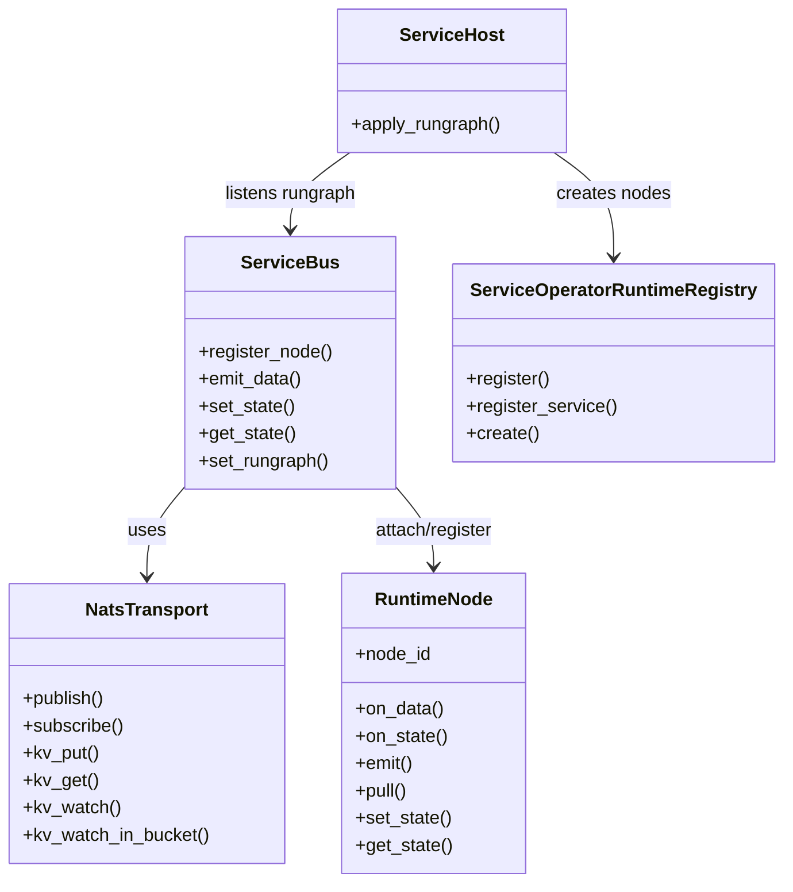

### RunGraph apply

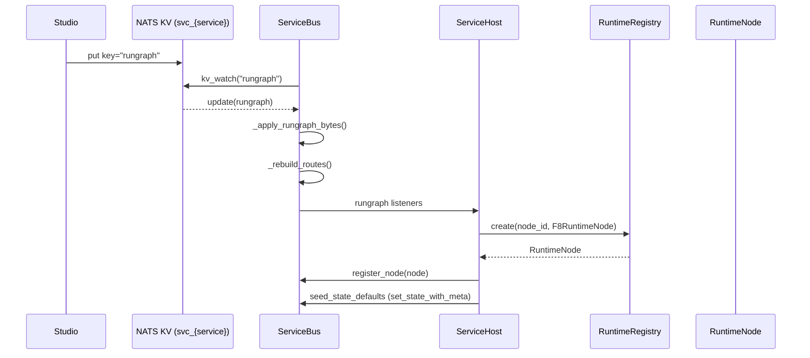

### Data flow (intra + cross)

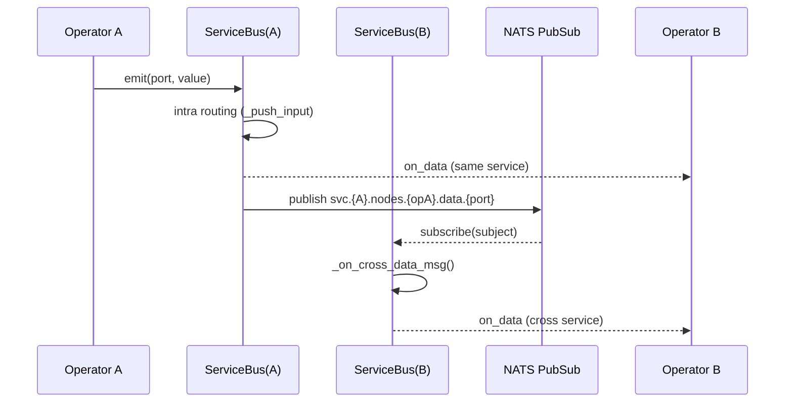

### State flow (KV)

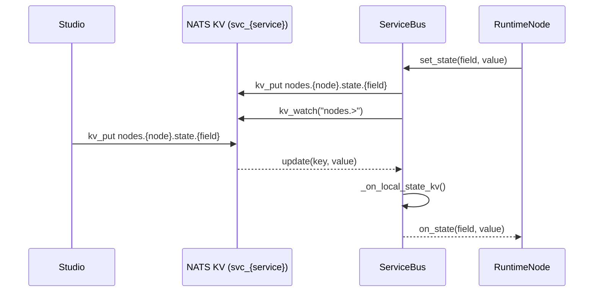

### Current issues

- `RuntimeNode` represents both service node and operator node.
- `operatorClass is None` is overloaded to mean "service node".
- Lifecycle is implicit and rungraph-driven only; service-level state
  (activate/deactivate) is not modeled.
- Third-party control is via KV writes, which is unsafe and bypasses validation.
- Data flow is push-based (`on_data`); target model removes `on_data` in favor of pull.

## Proposed Architecture (Target)

### Goals

- Separate service node vs operator node abstractions.
- Make lifecycle explicit and service-scoped (activate/deactivate).
- Move third-party control to command channel (request/reply), not KV.

### Proposed class roles (naming)

Use explicit interface-like names to reduce ambiguity:

- `IRuntimeNode` (base interface / protocol)
- `IServiceRuntimeNode`
- `IOperatorRuntimeNode`

Concrete implementations:

- `MyServiceRuntimeNode`
- `MyAOperatorNode`, `MyBOperatorNode`, ...

Host:

- `MyServiceHost` owns the service node and operator nodes.

Implementation note (current code):

- The SDK currently provides marker base classes `ServiceNodeRuntimeNode` and
  `OperatorRuntimeNode` (both derive from `RuntimeNode`) to reflect this
  separation in code.

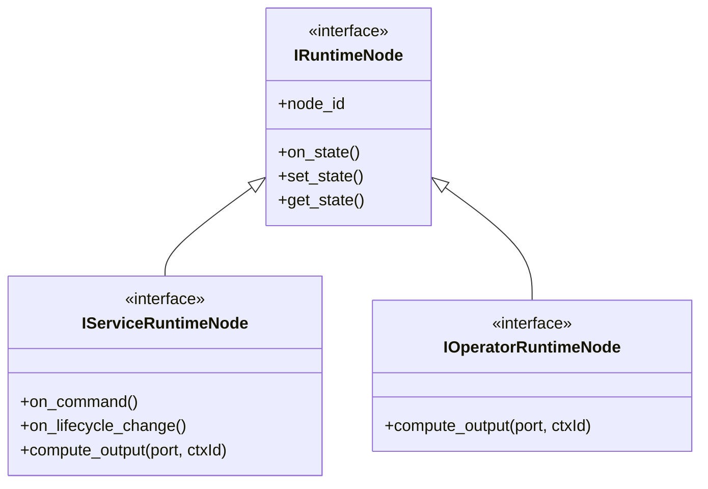

### Node creation flow

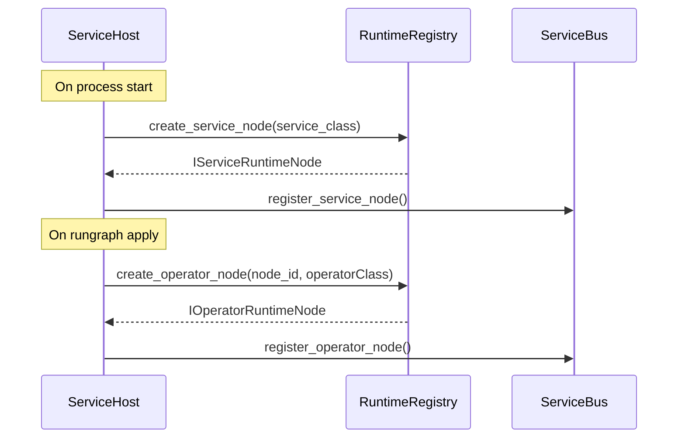

### Lifecycle control (activate/deactivate)

Service runtime exposes a boolean or enum state:

- `active`: operator processing is enabled
- `inactive`: operator processing is muted; runtime keeps communication
  (KV, commands, subscriptions) alive

Key behavior:

- exec/tick loops and output computation are gated by `active`.
- State updates and command handling remain enabled.
- Activation state is stored in KV for observability.
- If ticks are already running, allow them to finish; pause further execution
  when the service runtime owns the event loop.

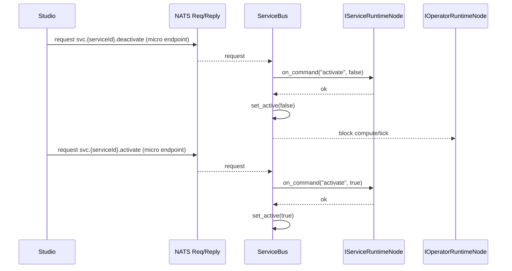

### Third-party control via command channel (request/reply)

Command channel replaces direct KV writes by third parties.

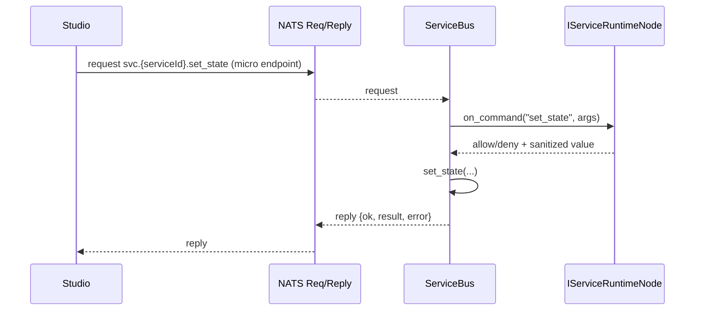

Command rules:

- Studio never writes KV directly.
- Service node validates and decides to apply or reject.
- Runtime writes KV only after validation.
- KV watch remains internal for intra-service consistency and cross-state edges.
- Command auth: v1 runs without access control (open publish/subscribe and KV).

Suggested built-in command set (runtime/admin; examples):

- `set_state` (validated state write)
- `get_state`
- `set_rungraph` (replace KV rungraph after validation)
- `get_rungraph`
- `activate` / `deactivate` (or `set_active`)

#### Req/Reply contract (v1)

Define a single JSON reply format for all req/reply commands (both runtime/admin
endpoints and user-defined service commands), so callers have uniform error
handling and tracing.

Request envelope (for unified `svc.{serviceId}.cmd`):

```json
{
  "reqId": "uuid-or-ulid",
  "call": "reload_model",
  "args": {"modelPath": "s3://...", "device": "cuda:0"},
  "timeoutMs": 3000,
  "meta": {"traceId": "t-123", "actor": "studio"}
}
```

Reply envelope (always returned for NATS request/reply):

```json
{
  "reqId": "uuid-or-ulid",
  "ok": true,
  "result": {"loaded": true},
  "error": null
}
```

Rules:

- If `ok=false`, `error` must be present and `result` should be null.
- `reqId` is caller-generated; runtime echoes it for logs/dedup/tracing.
- `timeoutMs` is a best-effort hint for runtime-side cancellation; caller must
  still enforce the NATS request timeout.
- For built-in micro endpoints (e.g. `svc.{serviceId}.activate`), the endpoint
  name implies the command; the request payload can be command-specific (often
  empty or args-only), but the reply should still follow the same envelope.

Standard error codes (examples):

- `UNKNOWN_CALL`: unknown user command name
- `INVALID_ARGS`: schema/validation failure
- `FORBIDDEN`: service node denied the operation
- `TIMEOUT`: runtime-side timeout/cancellation (best-effort)
- `INTERNAL`: unhandled exception

## Service node data flow (pull-based)

Service node can provide data as a source. The runtime requests outputs on-demand
using the same pull-based mechanism as operators.

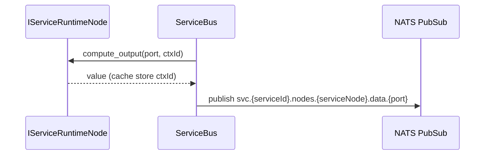

## Host transport and discovery (NATS micro)

Consider using NATS Python microservices for service discovery + request/reply:

- runtime host creates a NATS micro service on startup
- health/status endpoints expose service presence and active state
- runtime/admin commands are exposed as stable micro endpoints
- user-defined service commands are exposed via a single `cmd` endpoint
  with a JSON envelope (see next section)

Reference:
`https://github.com/nats-io/nats.py/blob/v2.12.0/nats/micro/service.py`

## Command envelope (single subject)

User-defined service commands (declared in `schemas/protocol.yml` under
`F8ServiceSpec.commands`) should be invoked via one unified command interface,
to avoid endpoint naming collisions and to keep the transport surface stable.

Instead of many per-command endpoints, use a single subject/endpoint like:

- `svc.{serviceId}.cmd`

Payload format:

- Request: `F8CommandInvokeRequest` (fields: `reqId`, `call`, `args`, ...)
- Reply: `F8CommandInvokeReply` (fields: `ok`, `result`, `error`, ...)

Notes:

- `call` is the command/function name (typically matches `F8Command.name`)
- `args` is a JSON object; the service node validates and sanitizes
- Caller decides whether to wait for a reply (sync) or just fire-and-forget
  (async); callee can always reply when ready.

Dispatch rules (proposed):

- If `call` matches a built-in runtime/admin command, handle it as a built-in
  (or reject here and require callers to use the dedicated micro endpoint).
- Otherwise, treat it as a user-defined service command:
  - if `editableCommands=false`, `call` must exist in `F8ServiceSpec.commands`
  - if `editableCommands=true`, allow dynamic commands but still validate args
    and return a structured error for unknown/invalid calls.

## Auth / ACL options (future)

MVP: assume an open NATS (no auth / no ACL). KV stores no sensitive data; reads are
allowed cluster-wide. Only KV write permissions and service publish permissions
need tightening later.

When adding access control, common options:

- NATS subject-based ACL (preferred baseline): restrict who can publish/request
  `svc.*.cmd` and `svc.*.<admin>` subjects at the NATS server/account level.
- Per-tenant/per-user NATS accounts or users: isolate subjects and permissions
  across tenants/environments.
- NATS auth callout (dynamic): NATS server calls an external auth service during
  connect; the auth service returns a per-process JWT with permissions derived
  from dynamic identity (e.g., role=studio vs role=service, serviceId, etc.).
- Micro-gateway / sidecar proxy: clients talk to a local gateway; the gateway
  validates identity/policy and forwards allowed requests to NATS.
- Payload auth (application-level): include a signed token (JWT) or HMAC in
  `meta`, validate inside runtime/service before executing.

Sidecar definition: a separate process/container deployed alongside the runtime
process (same host/pod) that handles cross-cutting concerns such as auth, rate
limits, auditing, metrics, and request routing without changing the runtime.

## NATS micro endpoints vs single `cmd` payload

- NATS micro endpoints: discoverable endpoints + built-in health/stats, clearer
  per-command semantics; downside is more endpoint naming/versioning surface.
- Single `cmd` endpoint with payload envelope: stable subject and fewer naming
  collisions; downside is weaker discovery/typing and more responsibility on
  payload validation, routing, and observability.

## Subject taxonomy (RPC vs Event/Data)

To keep "everyone can call RPC" but prevent arbitrary event spoofing, separate
subjects by intent:

- RPC/Command (wide publish/request): `svc.*.cmd` and/or `svc.*.rpc.>`
- Event/Data (restricted publish): `svc.{serviceId}.pub.>` (or `events.>`, `data.>`)

## Pull-based execution context

Each tick/exec pass should carry a context id (e.g., `ctxId`), so nodes can decide:

- reuse cached output for the same `ctxId`
- recompute when `ctxId` changes

Consumption tracking is not required; data can keep accumulating in caches/buffers,
and reuse is determined solely by the execution context id.

Example (ctx-driven pull):

```text
tick ctxId=42
  NodeC.exec(ctxId=42)
    requests NodeB.output("y", ctxId=42)
      NodeB cache miss -> requests NodeA.output("x", ctxId=42)
        NodeA computes x, stores cache(ctxId=42)
      NodeB computes y from x, stores cache(ctxId=42)
    NodeC uses y, emits result

tick ctxId=42 (same tick)
  NodeD.exec(ctxId=42)
    requests NodeB.output("y", ctxId=42)
      NodeB cache hit -> returns cached y
```

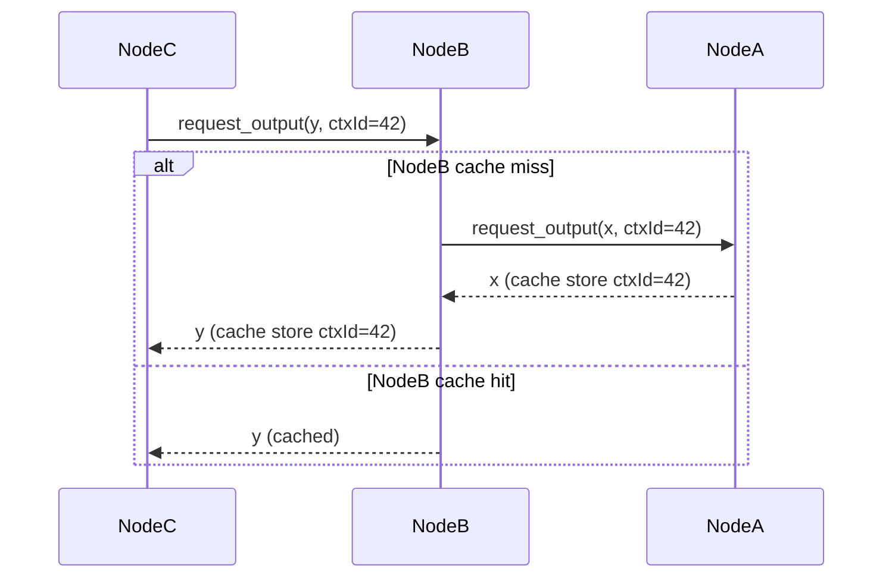

## Exec flow: Sequence operator

Sequence is a control-flow operator with one exec input and N exec outputs.
It activates each output in order, waiting for completion before moving to the next.

### Behavior

- On `exec_in`, initialize `index = 0` and emit `exec_out[index]`.
- When the current branch completes, increment `index` and emit the next output.
- When all outputs are done, emit `exec_done` (or return completion to caller).

### State

- `currentIndex`: int
- `ctxId`: execution context id (ties a sequence run to its tick/exec pass)
- `pending`: bool (whether a branch is currently running)

### Completion signaling

The runtime needs a completion signal for exec branches (per ctxId), so Sequence
can resume the next output. This can be modeled as:

- an explicit `exec_done` event emitted by the branch, or
- a runtime-managed completion callback for each exec emission.

### Example (sequence of three)

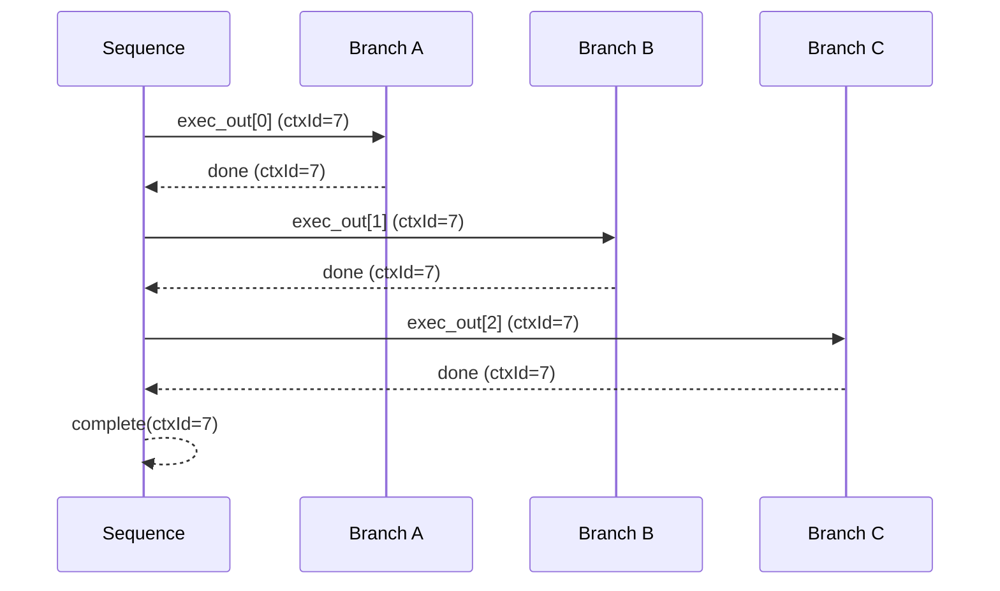

## Suggested API Surface (Bus)

- `ServiceBus.set_active(bool)`
- `ServiceBus.is_active`
- `ServiceBus.register_service_node(node: IServiceRuntimeNode)`
- `ServiceBus.register_operator_node(node: IOperatorRuntimeNode)`
- `ServiceBus.subscribe_cmd(cmd, handler)` or `ServiceBus.on_command(cb)`
- `IServiceRuntimeNode.on_command(call, args)`
- `IServiceRuntimeNode.compute_output(port, ctxId)`
- `IOperatorRuntimeNode.compute_output(port, ctxId)`

## Lifecycle hooks (proposed)

Runtime nodes should expose lifecycle hooks for resource management:

- `on_create()`: after node instantiation and registration
- `on_activate()`: when service runtime transitions to active
- `on_deactivate()`: when service runtime transitions to inactive
- `on_before_exec(ctxId)`: before a tick/exec pass (optional)
- `on_after_exec(ctxId)`: after a tick/exec pass (optional)
- `on_destroy()`: before node removal/unregistration

Service node can override all hooks; operator nodes primarily use `on_create`,
`on_activate`, `on_deactivate`, and `on_destroy`.

## Migration Notes

- Keep legacy `RuntimeNode` as base for both node types.
- Registry split: `register_service` vs `register_operator` explicitly.
- Add default service node if none registered (noop).
- Keep KV read/write for internal state and cross-service sync.
