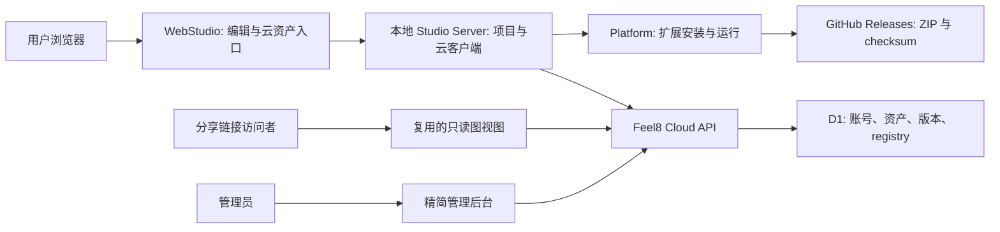

# AssetCloud 重新接入方案

2026-10-09。状态：P0/P1 已完成并提交；P2 Cloud 发布与 Library 已实现并完成隔离环境验收；线上迁移和部署尚未执行。本文基于当前 checkout 的实现核对；旧文档中的功能描述不作为实现完成的依据。

2026-10-09 更新：Variant 已实现完整单节点模板。Component 已接入统一搜索、同窗详情与左侧库。P2 增加 `/v2/library`、增量 D1 迁移、Studio Server Cloud 客户端、PKCE 登录、在线预览/插入、独立草稿、显式发布及点赞/关注。Library 采用在线目录直接查询、按需获取固定版本、本地独立草稿的设计，不建立双向同步的在线库镜像。详情、草稿发布及社区操作见 [Unified Library 方案](unified-library-plan.md)，其规则取代本文早期的 Library 同步/pull 设想。

建议将产品定位调整为 **Feel8 Cloud**，代码名称候选为 `f8cloud`：为 Studio 提供账号、资产发布、发现、订阅和扩展 registry。用户在 WebStudio 中完成主要操作；Cloud 保留独立 API、数据库和精简管理后台。重新接入前先收敛发布合同与版本语义，再连接网络同步。

## 当前实现与缺口

| 边界 | 已确认的实现 | 接入前的缺口 |
| --- | --- | --- |
| 本地编辑文档 | `f8studio-document/3`（兼容读取 /2），typed patch，graph/layout revision，原子提交、撤销及幂等 | 编辑计数与用户发布版本的呈现需要分开；已声明的 transient 触发不再修改保存状态 |
| 可移植完整图 | `f8graph/4`（兼容读取 /3）；定义快照去重、SHA-256 校验、稳定端口身份、导入校验；独立发布 manifest 与 content hash；不携带编辑 revision；已接 Cloud 发布 | 可复现安装锁属 P3；`resources` 尚不支持 |
| Cloud 组件 | v2 使用 `f8publication/1` 和 `f8component/1`；v1 的 `f8studio-session/1` 原始内容继续保留 | 旧内容转换属 P4；extension 类型属 P3 |
| 本地 component | 新捕获与新建使用 `f8component/1`；兼容读取旧本地 /1、/2，定义引用、外部宿主、选区端点、Server 原子插入与来源记录；已接显式 Cloud 发布 | 参数化入口后续另立合同 |
| 本地 variant | 完整单节点 `f8component/1` 模板，保存定制 spec/端口/代码及合规实例值；旧参数资产迁为 Preset | 本地和在线模板已共用 Add 搜索；在线库不镜像为本地资产 |
| Cloud variant | v2 使用完整单节点 Component publication；v1 保留旧 `spec` | 旧内容须显式转换，并通过发布合同校验；不能直接按名称映射 |
| Cloud 版本 | v2 有不可变版本、内容 hash 去重、持久发布回执和原子版本冲突检查；metadata 独立更新 | 线上增量迁移与部署待执行；v1 版本语义不自动改写 |
| 多用户 | 账号、所有者、public/private、点赞/关注、固定来源派生作品及许可检查、管理员 | 扩展发布者归属和协作者授权；尚非多人实时共编 |
| 前端 | 编辑器与独立只读 GraphView 共用 React Flow 投影、节点/端口视觉和样式；WebStudio 已复用其预览 Cloud 内容 | Cloud 独立分享页和旧内容页收敛属 P4 |

主要实现位置：`f8studio_core/graph/{models,exchange,store}.py`、`f8studio_core/compiler.py`、`f8studio_server/{assets,automation_tools,application,jobs,projects}.py`、`f8studio_web/src/{assets,graph}`、`cloud/src/repository.js`、`platform/f8platform/extension_artifacts.py`。

`docs/developers/component-authoring.md` 已更新为当前实现；Cloud 独立草稿已记录发布来源和基线。官方组件库、分类表单和 `graph_match_library` 尚未实现，不计入完成项。

## 协议稳定性与生态边界

现有图核心适合作为云接入的基础，当前发布合同还不足以承诺长期生态兼容。目标应是让已发布内容长期可读、依赖可追溯、升级显式进行；不是承诺协议永不增加版本。

保持四个独立边界：

| 合同 | 职责 | 演进规则 |
| --- | --- | --- |
| SDK service/runtime 协议 | 服务、算子、端口、运行图、控制与数据通信 | SDK 继续拥有共享协议和跨语言生成/测试 |
| Studio 编辑合同 | 内部文档、patch、revision、本地 HTTP | WebStudio 拥有；不直接作为云资产存储格式 |
| 可移植内容合同 | 完整图、组件模板和节点模板 | 有版本的显式模型和导出 schema；复用现有图定义及实例模型 |
| Cloud API 合同 | 身份、权限、发布、历史、registry、订阅 | 独立 API 版本；内容格式版本不随 API 或仓库发行版本递增 |

`f8graph/3` 的顶层禁止未知字段，因此不能直接加一个 dependencies 字段并宣称仍兼容版本 3。优先在有版本的资产 manifest 中携带依赖、来源和许可，让图内容继续使用当前格式。未来需要改变图语义时另升格式版本。

Cloud 消费由合同所有者生成和发布的 schema/fixture，不在 JavaScript 中手工复制 Python 模型。Cloud 发布不依赖加载 Studio 运行时；可移植合同可先由 WebStudio 生成独立 schema 制品。新 Cloud 公共边界使用明确的 TypeScript 类型及运行时校验，Python 边界使用静态 msgspec 模型和 tagged union。

已实施 `f8publication-manifest/1`：资产类型、内容格式和版本、许可证、发布来源，以及所需 extension ID、兼容版本/协议、service/operator class 和能力。第一版兼容版本使用显式接受版本集合（空集合表示不限），不猜测 SemVer 范围。可复现安装锁另外记录实际解析版本、平台、制品 URL 与 SHA-256，留待 P3。

定义 hash 只证明定义快照一致，不证明安装了实现、不证明作者身份，也不保证扩展行为兼容。自定义 renderer 必须有受支持的能力声明或普通节点显示回退；缺少扩展时应仍能只读预览，编辑和运行则给出明确缺失项。

资源第一期延续当前限制，不允许未定义的 resources。manifest 可声明需要用户提供的模型/文件及逻辑用途；本机路径、设备选择、连接密钥和云端凭据不作为可移植资产。资源打包和附件寻址以后按独立合同增加。

### 多用户与协作

graph creator、extension developer、normal user 是使用方式，同一账号可以同时具备这些身份。不要将其建成互斥账号角色。

第一期采用所有者发布、他人订阅/复制/fork；保留 fork 的来源资产和固定来源版本。需要共同维护时加入资产或发布者 namespace 的 owner/maintainer/viewer 授权，管理员/审核员权限另设。扩展作者应能证明 namespace 或上游仓库控制权；checksum 不能替代发布者认证。

GraphStore 的 revision 冲突检测可防止覆盖，但不是多人实时共编协议。实时共编需要另外设计共享项目、在线会话、操作合并与权限，不能通过同步资产版本假装实现。它不作为重新接入 Cloud 的前置条件。

### 兼容性承诺

发布可移植合同前固定历史 fixture、规范化规则、错误码和迁移策略。验收至少覆盖旧发布制品可读、定义/端口身份不丢失、缺失扩展的预览、导入失败不改变项目、跨语言 hash 一致。

对外承诺一个明确的支持窗口，例如最新稳定版及上一稳定版，并在客户端可见的能力响应中声明接受哪些内容版本。语义变化升版本，迁移通过显式工具完成，不在导入时猜旧字段含义或静默改写历史。

## Revision 与发布版本

当前 GraphStore 按实际变化递增：一个 patch 批次最多增加一次 graph revision 和一次 layout revision；无实际变化不增加。撤销/重做创建新的编辑 revision。运行图另外使用 `semantic_graph_revision` 的 SHA-256，忽略布局、节点显示名和部分 UI 元数据。

已确认的运行交互写入路径是 `StateFieldControl` 的数字 button：点击提交 `current + 1`，经过 `setNodeState` 保存到文档；热键也先提交图状态，再同步运行时。实施前触发次数会影响编辑 revision，甚至运行图语义 hash；现在已声明 persistent=false 的触发由同一接口送运行时，不再保存或递增 revision。独立 command 调用走运行时接口，部署创建 job 并读取文档；这两个路径本身不递增图 revision。此结论来自源码和已有测试，尚未针对用户具体图做现场复现。

| 标识 | 含义 | 是否驱动云发布 |
| --- | --- | --- |
| graph/layout revision | 本地编辑并发控制计数 | 否 |
| runtime semantic hash | 部署输入语义标识 | 否 |
| content hash | 规范化后的可发布内容，包括必要的显示信息 | 用于相同内容判断及完整性校验 |
| asset version | 一次明确发布产生的不可变内容版本 | 是 |
| 可选 release label | 作者希望展示的名称或 SemVer | 展示及依赖声明，不替代内容版本 |

无需因为编号增得快改用随机 ID、重置计数或减小计数频率。现有整数范围足够正常使用；关键是防止把编辑计数当作发布版本或内容差异。即使从 revision 10 编辑到 500，云端 v1 也应保持 v1，直到作者发布新内容。

### 状态保存与发布策略

采用字段显式声明、确定性图分析、作者按实例调整三层规则。不能单凭 RW、控件类型、字段名称或值变化频率推断是否是程序参数；本地需要记住的配置也不一定适合共享。

已确认采用 `persistent` / `publishable` 两个布尔字段及以下基本语义，移除发布策略中的 `input`、`value`、`omit` 枚举。字段和运行行为已经实施，版本迁移见 graph-schema.md：

```json
{
  "persistent": true,
  "publishable": false
}
```

| 字段 | true | false |
| --- | --- | --- |
| persistent | 将配置值保存在本地项目，下次加载恢复 | 值仅用于当前运行，不写入项目 |
| publishable | 允许保存的配置值进入组件或共享图，发布者仍可排除 | 值不得进入组件和共享图 |

SDK 定义编辑器的 UI 文案对应“保存到本地项目”和“允许包含在组件与共享图中”。发布界面的实例勾选项为“包含此配置值”，仅对 publishable=true 的配置开放。字段均控制 state 的值，不删除字段定义、类型、端口或控件。共享图指作为资产分享的图内容，不包括完整本地项目备份。publishable 不控制运行时 publish_state 广播。

这两个维度不改变 `access: ro/rw/wo` 的含义，也不代替 value schema 或 runtime 必需值验证。`persistent=false` 时，`publishable` 必须为 false；RO 字段的运行值也不得保存或共享。需要初始配置时以明确保存的配置表达，不在发布时采集 live state。WO 字段不能自动判断为动作，仍须由定义声明；真正的执行动作继续使用 command/exec。

字段是否保存和允许共享由 extension developer 在 `F8StateSpec` 中声明；PyScript 作者为自定义 state 声明同样的信息。Graph creator 可以在发布设置中对 publishable=true 的具体节点字段选择包含或排除，实例选择通过 typed 导出请求传递；复用的发布 profile/manifest 留待后续实现，不为这次发布修改全局节点定义。publishable 表达字段的共享资格，实例勾选表达这次是否携带，二者不混用。

`persistent=false`、`publishable=false`、RO 或 `redactOnPublish=true` 的值不能被发布勾选项重新带出。`redactOnPublish` 作为兼容的强制限制继续生效。排除一个值不意味着使用者必须填值，也不意味着必须创建上游节点。

旧节点没有新策略时保持 writable 本地保存行为，默认允许共享；RO 与已有 redaction 立即适用。导出界面显示本次携带的实例值，作者可额外排除。SDK describe 输出及新节点快照规范化为显式策略；发布 profile 的长期保存和扩展发布强制声明仍待 Cloud 合同实现。

#### 具体字段的分类

| 例子 | persistent | publishable | 原因与例外 |
| --- | --- | --- | --- |
| 播放器 `mediaUrl` 的本机路径 | true | false | 本地记住文件，共享时清理；播放器可先启动、之后打开媒体，不声明必填输入 |
| 播放器当前音量 | false | false | 临时播放操作不影响资产版本；作品设计的初始音量另明确保存为配置 |
| playing、duration、availableBones | false | false | 状态回报或当前输入的枚举结果；保留字段定义、端口和控件结构 |
| 需要记住的场景实例 ID、角色选择 | true | false | 保存使用者的本地绑定；仅临时选择时两项均为 false |
| 固定骨架的 `BoneSelector.target` | true | true | 指定哪根骨骼参与计算；跨 rig 模板可排除具体绑定，但不能静默改变预期行为 |
| 平滑系数、阈值、算法选项、脚本 code | true | true | 定义图的计算行为，应保存作者配置 |
| token、连接密钥 | 按本地凭据存储方式决定 | false | 不发布字面量；不允许实例选择绕过 redaction |

源码已确认：播放器 `mediaUrl` 声明了 `redactOnPublish`，现已将 `volume` 标记为 persistent=false、publishable=false；`BoneSelector.availableBones` 是 RO，`target` 是 RW。其 target 为空或不在当前列表时会选择第一根骨骼，所以清掉 target 后可能静默改变组件行为。不能将可用骨骼列表、当前场景对象与逻辑目标骨骼混为同一种临时状态。

#### 图分析的范围

RO 值目前已被 authoring document 校验禁止保存。`compile_document` 也会从最终运行图的初始值中剔除上游 state 连接目标；完整本地备份 `export_graph` 保留 persistent 的实例值。新增 `export_shared_graph` 和 component 捕获集中执行发布投影，清理实例值，保持本地项目不变。

对于上游绑定，只在最终部署中连接仍有效时省略目标字段的实例初始值：解析实际端口身份、字段、节点 enabled 状态和模板保留的连接，不能只扫描名称或原图中是否曾有连线。本地项目仍可保留作者断开连线后使用的配置，发布清理不修改原项目。

component 从选区导出时尤其要分析跨边界连接。若原上游没有进入组件，需要检查目标字段的通用默认行为或作者初始配置是否仍能支持组件预期功能，不能保留旧运行值，也不能因原图存在上游就直接删值而忽略失去参数来源。图结构可以确定“参数来源被切断”，不能推断作者期望的替代值。缺少必要配置时给出具体未解决项，由作者补齐。

组件参数与运行时 state 连线另行设计，不属于发布字段的第三种值。未来组件参数可以绑定节点配置并声明 schema、默认值和是否必需；使用者在插入时填写，不要求新增上游节点，填写后按 persistent 决定是否保存自己的本地配置。首期排除字段不自动生成组件参数，不自动声明必填，也不在 stateValues 中插入占位字符串。

运行时观测值始终与作者初始配置分开。可提供明确的“保存为初始配置”动作，但不能在发布时读取 live state 来填模板。高频计数、FPS、latency 继续只走 monitor/data，不进入 state 持久化。

#### 协议升级与实施约束

字段保存与共享语义属于 SDK state spec，实例发布选择属于 Studio 发布合同；组件参数属于单独的组件合同。Cloud 执行已声明规则，不维护一套按字段名猜意图的黑名单。SDK spec 和图交换模型对未知字段有严格边界，新增可选字段也不能直接视为旧客户端兼容。将新策略写入 spec 时须明确 spec/内容版本和支持窗口，协调 Python/C++/TypeScript 生成，并保留旧 `f8graph/3` 读取能力。

完整本地备份 `export_graph` 不作为发布内容；共享导出、整图 component 捕获及资产历史导出执行发布投影。投影处理 persistent/publishable、有效绑定、实例选择及 redaction，只清理实例 stateValues；按已确认的范围，定义 default/examples 完整保留，不将定义默认值复制为实例值。不得为清理实例值删除字段定义或端口；定义发生规范化后重新计算 hash 和引用，再校验完整内容。

迁移覆盖内联控件、Inspector、热键、Agent、CLI/MCP 和部署初始值。配置修改可以是有效编辑；persistent=false 的操作不修改 authoring document，发布 hash 只对清理后的内容计算。

验收增加：音量/触发变化不改变发布 hash；mediaUrl 的实例值不进入组件内容，定义 default/examples 保留，播放器仍可无媒体启动；算法参数修改改变 hash；骨骼目标保留时维持行为，排除时说明需要重新配置的具体绑定；有效上游绑定与选区切断上游产生不同结果；清理不修改本地项目；缺少真正必需的配置时部署明确失败。

### 发布、同步和冲突

第一期默认显式 Publish；关注只提示有新版本，用户预览、添加或创建草稿时才获取固定版本内容。导入的 component 是普通节点副本，源组件升级不会改变已插入的节点。扩展也不因关注或图预览而自动安装、升级或运行。

如以后提供个人云草稿备份，使用单独的可变 draft 记录与防抖策略；备份不生成公开 asset version，不通知订阅者。每次 patch 不直接请求远程发布。

已实施的 `f8publication-hash/1` 覆盖完整发布内容及 manifest，排除本地 revision、时间戳、运行状态和本机 project/graph ID；图内节点与端口身份仍保留。按模型定义集合排序、展开模型默认值，以带类型标记的 JSON 树与 binary64 数字 token 避免 Python/JS 数字打印差异；两端共用固定 fixture。保留会影响预览/复用的名称、布局和端口显示信息。完整规范与生成 schema 见 `extensions/f8webstudio/contracts/README.md`。

Cloud 收到相同当前 hash 的发布时返回当前版本，不追加版本。相同请求的网络重试使用持久 idempotency key 重放结果。发布要求 expected version，冲突返回 409；v2 以单次 INSERT 和数据库触发器完成版本插入、head 更新及回执保存，条件比较和写入处于同一事务。v1 的旧版本流程保持原状，不作为 v2 发布入口。

metadata 修改继续使用独立接口，不生成内容版本。当前历史查询以当前 head metadata 组合旧 blob，因此要明确哪些 metadata 是可变目录信息；许可证、依赖、发布者来源等复现所需信息必须随版本保存。内容版本不可原地修改，回滚通过选择旧版本或发布新版本表达。

列表返回版本、hash 和小型摘要；内容接口支持缓存验证。更新提醒不下载完整图，下载后本地缓存固定版本，Cloud 不推送每次本地编辑。

## Cloud 重构、前端与名称

建议保留 Cloudflare Worker/Hono、Better Auth、D1、现有用户与订阅能力，重点重构内容合同、发布事务和 Studio 接入。不是从头重写账号系统或再做一套编辑器。



WebStudio 是本地 Web 应用，不等于已经部署了一个公网 Studio。Cloud 资产页与本地运行平面要保持明确边界。分享链接如需无需安装即可预览，应使用可托管的只读 bundle，而不是启动 Python/Zenoh/媒体网关。

从 `projection.ts`、节点/端口展示和 React Flow 画布中提取共享 `GraphView`，使用显式 readonly/interactivity 输入。它只接收已校验的快照和显示信息，不依赖项目 patch、部署、runtime live store 或 installed catalog；实时媒体/设备控件在预览中使用静态占位。编辑器通过组合附加手势和 Inspector，公共预览复用相同节点视觉。

普通用户的 Browse、我的资产、发布、订阅和版本操作整合到 WebStudio。旧 console 在过渡期保留，待这些入口和认证跳转替换后收缩；尤其不能先删验证邮件、密码重置和 OAuth 回调所用页面。

管理后台仍有必要，但只负责用户封禁/恢复、资产审核/隐藏、发布者身份、站点设置和必要的审计查询。可以保留现有 console 的管理部分；管理员角色和授权始终由 Cloud 校验。管理后台不实现另一套图编辑，也不负责本地运行环境管理。

认证需要分别验证本地 HTTP/WebStudio 和托管预览两种部署。复用现有浏览器 session 与本地客户端 token 流程，优先让 Studio Server 保存 refresh token；CORS、回调 URI 与 cookie 策略按实际 origin 配置，不能因为前端都使用 Web 技术就假定同源。第一期不要求浏览器持久保存 Cloud refresh token。

对外名称建议 Feel8 Cloud；扩展发现页可以叫 Extension Registry，图和组件页面沿用 Library。先更换产品文案和定位，仓库/package 名称以后与独立版本一起迁移，不将品牌变化强制绑定 API URL、asset ID 或数据库重建。

### 资产类型与 extension registry

| 对外类型 | 内容与用途 | 分发方式 |
| --- | --- | --- |
| graph | 完整 `f8graph/4` 和发布 manifest | Cloud 保存有版本内容，下载成独立项目 |
| component | 单节点或子图模板，包含完整 spec、代码/配置、布局和绑定要求 | Cloud 保存模板，插入后展开为普通节点 |
| extension | 版本、能力、兼容协议、平台制品、来源、许可证与 checksum | Cloud 仅保存 registry，ZIP 可由 GitHub Releases 提供 |

本地 Variant 已作为完整单节点 Component 模板；仅参数资产称为 Preset。不能让一个名称同时代表“完整 spec”与“仅 state 配置”。已有 modding_recipe 资产保留自身合同，可作为附加资产类型演进，不必重塞进 graph 内容。

extension release 一经发布，version/platform/URL/hash 对应关系不可原地改写。registry 返回 HTTPS ZIP 和 SHA-256，复用 Platform 已有的下载、checksum、解包和安装校验。新增工作主要是 registry 查询、版本/平台/协议解析和用户安装入口，不是再造 installer，也不在用户机器上从任意 GitHub 源码临时构建。

D1 先继续承载现有规模的元数据和小型版本内容。是否将大型图/附件迁入 R2，应根据真实内容尺寸、数据库限制和读写测量决定；附件不在首期范围。

## Component 的目标行为

本地 component 已完成作者保存、统一 Library 搜索、详情预览和插入闭环。第一阶段将其明确为 authoring template，不引入新的 runtime component 节点或嵌套执行模型。

例：作者在 `f8.pyscript` 中写好平滑算法，定义输入 value、输出 smoothed 与参数 alpha，然后将选中节点保存为 component。用户从 Library 插入，选择当前 PyEngine 作为宿主，得到保留代码、端口、状态 schema 与默认参数的普通 PyScript 节点。更新库中模板只提示新版本；旧图不会被替换。

P0/P1 已实现以下行为（组件参数仍另行设计）：

1. “保存选区为组件”，支持单节点和多个节点；保留选区内部连线，跨选区边转为显式连接提示或接口声明。
2. 完整保存定义快照及配置，复用 `f8graph/4` 的定义引用与端口身份模型；不要把内部派生 ports 和整个 GraphNode 当长期发布协议。
3. P0 已实施独立 `f8component/1`，带 required host bindings、暴露端点及独立依赖 manifest，复用定义引用与端口身份。旧本地 component/1、/2 可显式转换；参数化入口未纳入第一版。
4. Server 完成宿主绑定、节点/边 ID 重映射、布局偏移和原子校验，HTTP、Agent、CLI/MCP 共用这条操作；Assets UI 已移除浏览器 ID 重映射。只读 GraphView 与编辑器共用节点视觉和样式，有独立 JS/CSS 构建入口。
5. 来源 asset ID、固定版本、宿主及插入映射与图变更同事务保存。记录属于本地数据库，不改变节点所有权，不做自动替换；本地 graph 备份暂不携带这份插入历史。重试遵循项目已有的有限回执保留窗口。
6. PyScript 第三方依赖通过 extension/runtime 声明；复用脚本不在插入时偷偷 pip install。预览和下载不执行代码，用户部署时才进入既有运行边界。

以后若需要可折叠、可复用且保持外部接口的真正子图实例，应另立设计讨论生命周期、升级、调试和编译展开；首期模板系统不预先承担这些语义。

## 分阶段实施与验收

| 阶段 | 状态 | 交付 | 完成条件 |
| --- | --- | --- | --- |
| P0 合同与 revision | 已完成、已提交 | 发布 manifest、component 合同、hash fixture、持久化语义、发布脱敏与版本策略 | 运行触发不污染保存内容；同一发布内容 hash 稳定；布局变化保留；依赖和缺失能力有明确错误；旧格式迁移规则明确 |
| P1 本地组件闭环 | 已完成、已验收 | 选区保存、PyScript 完整模板、宿主绑定、Server 原子插入、只读 GraphView、统一 Library 搜索与详情 | 脚本端口/代码完整往返；重复插入不冲突；无需新建重复 Engine；缺失扩展仍可预览；失败不修改项目 |
| P2 Cloud 发布与 Library | 已完成隔离环境验收；未上线 | 新 API 合同、数据库增量迁移、并发/幂等发布、WebStudio 登录/在线查询/草稿发布/关注更新/固定版本获取 | 相同内容不增版本；重试只发布一次；并发更新一个成功一个冲突；离线编辑可用；本地 revision 不触发上传；按需获取固定版本，无本地在线库镜像 |
| P3 Extension Registry | 待实施 | 发布者归属、版本/平台/协议清单、GitHub 制品解析、Platform 安装入口 | URL/hash 校验；版本不能改写；缺失依赖可解释；安装/升级不隐式改变正在运行的图；原有回退机制可用 |
| P4 前端收敛与迁移 | 待实施 | Feel8 Cloud 文案、精简 console、分享预览、旧数据转换工具 | WebStudio 覆盖日常资产操作；认证页面迁移无断链；管理员可审核；旧资产转换有成功/失败报告且保留原始内容 |

P0/P1 已在本地完成，无需部署 Cloud；P2 在测试环境验证完整 graph/component 发布闭环后，再逐步上线。各仓库独立发行，Cloud 部署不随 Studio gitlink 更新自动触发。

已有 `f8studio-session/1` 资产需要显式转换为 graph 或 component，不能只改 schemaVersion。转换须解析旧 layout/节点类型、关联已知定义，保留原始 blob 与版本来源；无法恢复的节点给出报告，不静默丢弃。D1 使用后续增量 migration，不修改已应用的初始迁移，也不清空用户和资产。

第一期边界为资产交换和扩展发现。个人草稿云备份、团队协作、实时共编、嵌套子图实例、资源托管可以在这些合同稳定后独立推进。

## 本次实施范围与验证

本地合同已实现：SDK 显式状态策略及 Python/C++/Web 生成，document/graph/component 旧格式读取，运行时更新不保存、不增加 revision，共享 graph/component 清理实例值及作者勾选，asset 历史和 variant 值策略校验。默认值和示例保留。已有动作继续使用 command/exec，没有增加 input 发布策略。

P0 补齐：独立 publication/manifest/component 静态模型和生成 schema；发布 hash 的 Python/Web 共用 fixture；缺失 extension、版本、协议、service/operator 和能力的明确诊断；embedded definitions 支持离线预览；capabilities 返回支持窗口。

P1 补齐：选区捕获与实例排除 UI、完整 PyScript spec/代码/端口往返、现有宿主选择和多宿主分组布局、固定版本的 Server 原子插入与来源记录、重试和重复插入、缺失/不兼容定义预览、复用编辑器视觉的独立 GraphView。Node、Variant、Component 已共用 Add from Library 搜索入口，支持同窗详情/版本预览及左侧组件库。回归覆盖并发 revision 冲突、重启后重试、数据库写入失败回滚和 Agent 原有审批路径。

2026-10-09 本地闭环验收：230 项 Web 单元测试、106 项核心及相关服务端测试、3 项桌面端 Playwright 流程（Component、Variant、state authoring）通过；严格 Python/TypeScript 类型检查、Web 生产构建和合同生成一致性检查通过。

完成 Pixi 管理环境下的核心、服务端、SDK、Web 回归，严格 Python/TypeScript 类型检查，合同生成一致性检查，以及 C++ SDK 测试和播放器编译。新增回归覆盖旧图 hash 校验与迁移、运行时触发和重试、私有值清理、定义默认值保留、有效上游连接、作者排除及历史资产导出。

P2 补齐：独立 TypeScript Cloud API、生成 publication schema/fixture、D1 增量迁移和单 SQL 发布事务；相同内容去重、不可变历史、并发冲突、持久发布回执和独立 metadata 更新。Studio Server 持有凭据并刷新，WebStudio 使用 PKCE 登录、直接在线查询及固定版本下载校验。远端模板复用现有插入事务，Cloud 来源与图变更一起保存，浏览和插入不创建本地资产；创建草稿是显式操作。草稿来源、许可及待发送发布快照持久保存，网络结果不确定时重试原始快照。新增点赞、作者/资产关注、Following 视图及新版本提示；不会自动替换节点。完整 graph 支持发布、预览和创建独立项目。

P2 验收：382 项核心/服务端完整回归、最终 235 项 Web 测试、55 项 Cloud 后端及 21 项旧 console 测试通过；新增 Cloud 集成组最终 9 项通过。4 条桌面 Playwright 流程通过（Cloud、Component、Variant、state authoring）；Cloud 最终复测增加回包丢失、页面刷新和原请求恢复。严格 Python/TypeScript 检查、生成合同一致性、Web/console 构建及 Wrangler 临时本地 D1 迁移通过。详见 [P2 实现与检查](cloud-p2-implementation.md)。

此次仍不包含线上 Cloud 部署、旧在线资产转换、extension registry、组件参数、托管分享页或多人实时共编。D1 版本内容当前限 1 MiB，不托管附件。登录沿用 Cloud 的 loopback 客户端流程；远程托管 Studio 的登录方式另行设计。测试不替代线上数据迁移验收。
