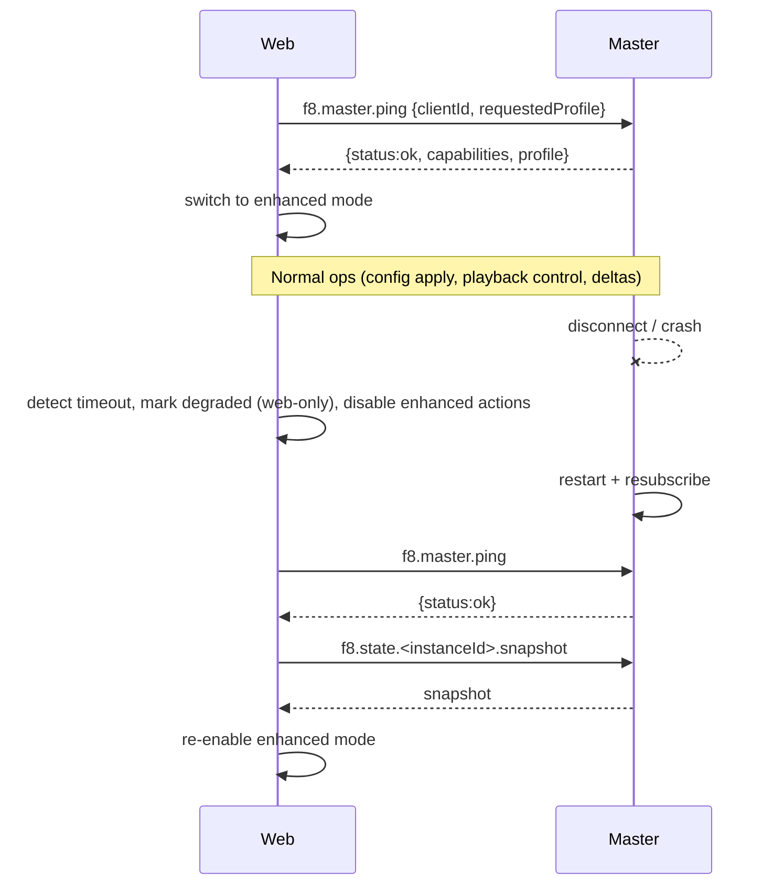

# Connect, Degrade, Recover (Web <-> f8master over NATS)

Sequence (single user, single connection):

Notes:
- Transport is NATS request/reply (not expanded in the diagram).
- Enforce single client: master rejects a second `clientId` (or kicks old session).
- When master drops, engines keep running the last applied graph but mark apply endpoints read-only; web enters degraded mode (no deploy).
- Web-only mode keeps graph edit/save; playback/daemon-backed actions disabled.
- After reconnection, fetch snapshot/etag before sending new edits to avoid stale apply; then re-enable enhanced mode.
