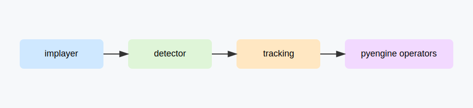

# Scene 01: Offline Video Tracking

## Goal

Track a target in a local video file and route tracking data to runtime control logic.

## Topology

`implayer -> detector -> tracking -> pyengine operators`

## Prerequisites

- `f8.implayer`, `f8.dl.detector`, `f8.cvkit.tracking`, `f8.pyengine`
- Local test video file
- ONNX environment for detector service

## Steps

1. Start services in Studio and connect nodes in the topology order.
2. Set `implayer` input to a local video.
3. Route detector output to tracking init/updates.
4. Route tracking output into pyengine operators for downstream control.
5. Save session JSON for headless reuse.

## Session Artifact

Recommended storage path: `docs/scenarios/sessions/scene-01-offline-video-tracking.json`.

## Validation

- Tracking state toggles from idle to active.
- Bounding box updates across frames.
- PyEngine output values change with tracked motion.

## Troubleshooting

- No detections: verify ONNX model path and confidence thresholds.
- Tracking stalls: validate detector payload schema and bbox path.
- Low FPS: increase detector interval or use lighter model.

## Video

<iframe width="720" height="405" src="https://www.youtube.com/embed/VIDEO_ID_SCENE_01" title="Scene 01" frameborder="0" allowfullscreen></iframe>
