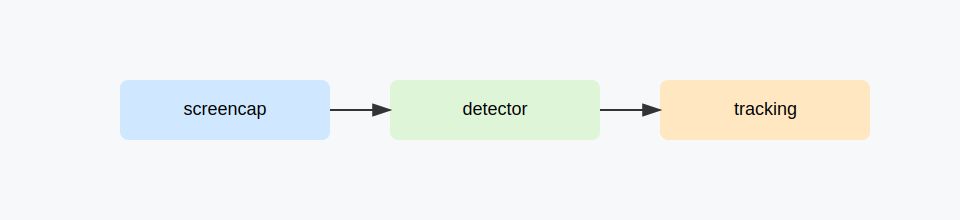

# Scene 02: Desktop Live Tracking

## Goal

Capture desktop frames in real time and perform live detection + tracking.

## Topology

`screencap -> detector -> tracking`

## Prerequisites

- `f8.screencap`, `f8.dl.detector`, `f8.cvkit.tracking`
- Desktop capture permission
- Supported backend (Windows WGC or Linux X11)

## Steps

1. Start `screencap` and select display/window source.
2. Feed frames into detector service.
3. Feed detections into tracking service.
4. Observe tracking state and bbox outputs.

## Session Artifact

Recommended storage path: `docs/scenarios/sessions/scene-02-desktop-live-tracking.json`.

## Validation

- Continuous frame ingestion from desktop source.
- Detector emits `detections` payload regularly.
- Tracking output maintains object lock during motion.

## Troubleshooting

- Linux black screen: ensure X11 session and valid `DISPLAY`.
- Missing detections: verify detector service health and model config.
- Jittery tracking: tune tracker init strategy and frame rate.

## Video

<iframe width="720" height="405" src="https://www.youtube.com/embed/VIDEO_ID_SCENE_02" title="Scene 02" frameborder="0" allowfullscreen></iframe>
