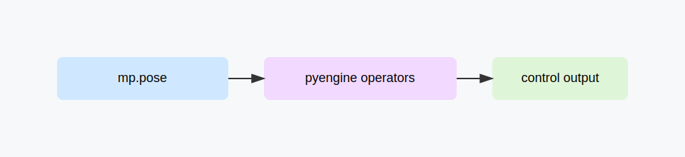

# Scene 03: Realtime Pose Control

## Goal

Use live pose estimation and PyEngine operators to drive realtime control output.

## Topology

`mp.pose -> pyengine operators -> output/control`

## Prerequisites

- `f8.mp.pose`, `f8.pyengine`
- Realtime video source (camera or shared memory producer)
- Operator chain for mapping pose data to control values

## Steps

1. Configure `mp.pose` with incoming frame source.
2. Connect pose output to PyEngine operators.
3. Add smoothing/range mapping operators as needed.
4. Route final output to target control endpoint.

## Session Artifact

Recommended storage path: `docs/scenarios/sessions/scene-03-realtime-pose-control.json`.

## Validation

- Pose detections update continuously.
- Operator output tracks user movement.
- Control endpoint receives stable bounded values.

## Troubleshooting

- Pose missing: check input SHM/source and confidence thresholds.
- No downstream reaction: inspect operator wiring and output ports.
- Noisy output: add smoothing and rate limit operators.

## Video

<iframe width="720" height="405" src="https://www.youtube.com/embed/VIDEO_ID_SCENE_03" title="Scene 03" frameborder="0" allowfullscreen></iframe>
