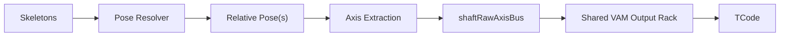
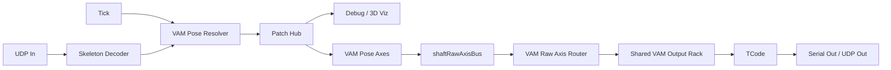
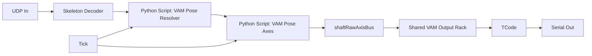
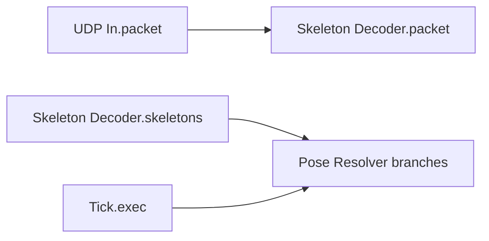
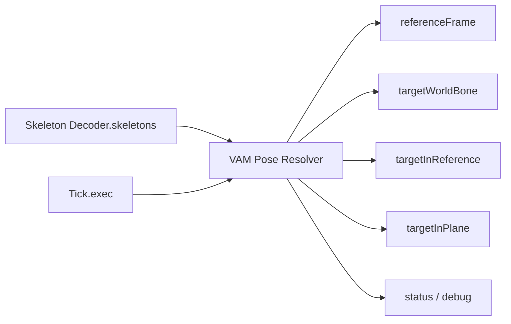
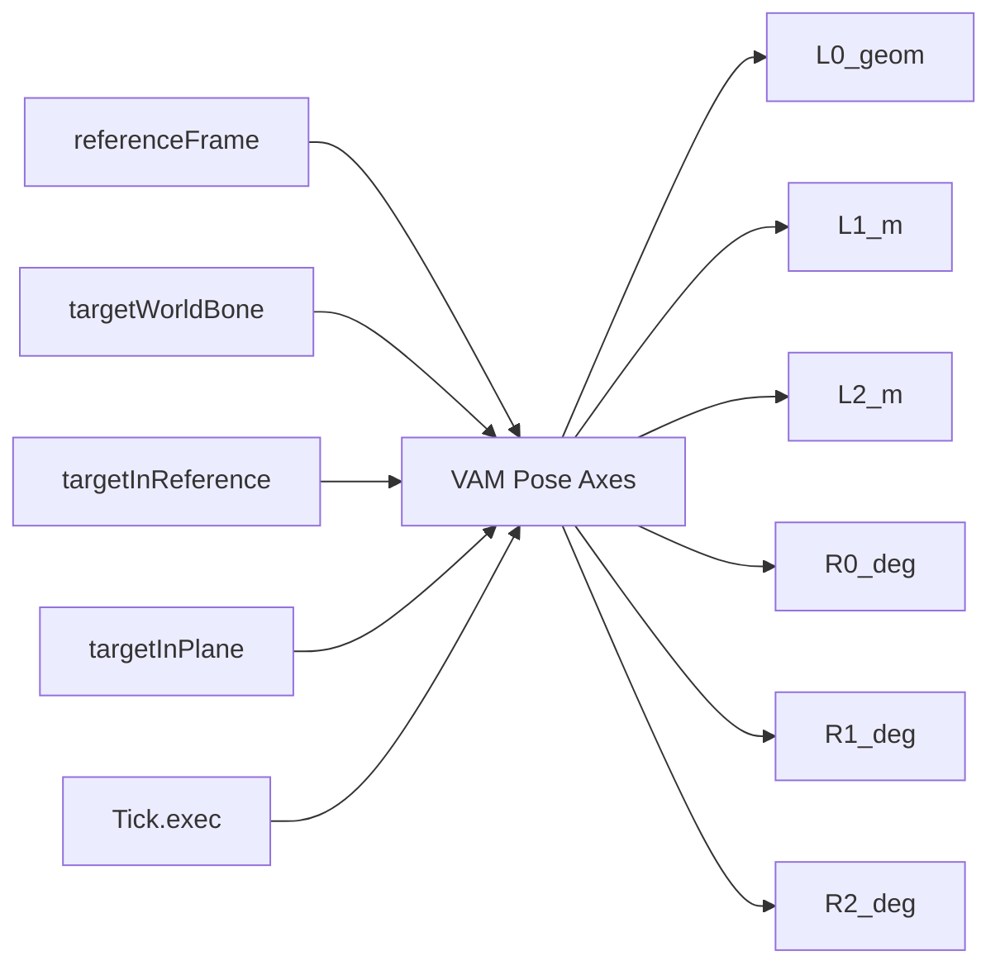
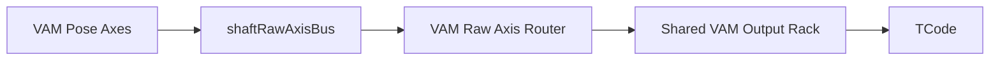
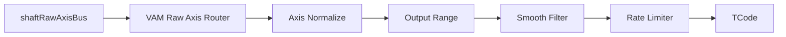

# VAM (1): Male-Referenced Motion

This scene is a design guide for the VAM pose pipeline in Web Studio. The graph
uses explicit stages for pose resolution, relative pose output, axis extraction,
raw axis bus output, shared normalization, signal shaping, and final TCode
formatting.

Recommended pipeline:



```text
Skeletons -> Pose Resolver -> Relative Pose(s) -> Axis Extraction -> shaftRawAxisBus -> Shared VAM Output Rack -> TCode
```

The first script operator is `VAM Pose Resolver`. It analyzes streamed
skeletons, decides which reference and target are active, and emits explicit
pose objects that downstream operators can inspect and transform.

## Design Principle

The Web Studio graph uses these explicit roles:

- `VAM Pose Resolver` resolves a reference frame and a target frame.
- `VAM Pose Axes` or small `Data Expr` nodes project pose into semantic axes.
- `shaftRawAxisBus` carries raw semantic axes to the unified VAM graph.
- The shared VAM output rack handles normalization, output range, smoothing,
  rate limiting, overrides, and final device feel.
- `TCode` assembles final TCode command strings.

That keeps each stage small, replaceable, and easy to debug.

## Recommended Graph

The recommended graph shape is:



```text
UDP In.packet -> Skeleton Decoder.packet
Skeleton Decoder.skeletons -> VAM Pose Resolver.skeletons
Tick.exec -> VAM Pose Resolver.exec

VAM Pose Resolver.referenceFrame -> Patch Hub.referenceFrame
VAM Pose Resolver.targetWorldBone -> Patch Hub.targetWorldBone
VAM Pose Resolver.targetInReference -> Patch Hub.targetInReference
VAM Pose Resolver.targetInPlane -> Patch Hub.targetInPlane

Patch Hub.* -> optional Bone Filter / debug visualizers
Patch Hub.* -> VAM Pose Axes or Data Expr scalar extractors

VAM Pose Axes raw outputs -> shaftRawAxisBus
shaftRawAxisBus -> VAM Raw Axis Router
VAM Raw Axis Router -> Shared VAM Output Rack
Shared VAM Output Rack -> TCode -> Serial Out or UDP Out
```

`Patch Hub` is optional, but useful once the same pose outputs feed several
debug, analysis, and output branches.

### Minimal V1 Graph

For a first working scene:



```text
UDP In -> Skeleton Decoder -> Python Script: VAM Pose Resolver
VAM Pose Resolver -> Python Script: VAM Pose Axes
VAM Pose Axes -> shaftRawAxisBus -> Shared VAM Output Rack -> TCode -> Serial Out
```

This keeps the custom Python limited to two explicit tasks:

1. Pick and reconstruct pose.
2. Convert pose into semantic axis signals.

Everything after that is regular graph signal processing.

## Operator Roles

| Operator | Role in the modular design |
| --- | --- |
| `UDP In` | Receives UDP packets from `ignore/Feel8.SkeletonStreamer`. |
| `Skeleton Decoder` | Decodes streamed skeleton packets, handles keys, and keeps latest skeletons. |
| `Python Script: VAM Pose Resolver` | Selects reference/target streams and emits structured pose objects for the next layer. |
| `Patch Hub` | Optional canvas routing node for fan-out and cleaner wiring. |
| `Bone Filter` | Optional smoothing for `targetWorldBone`, `targetInReference`, or `targetInPlane`. Useful before scalar extraction if skeleton jitter is visible. |
| `Python Script: VAM Pose Axes` | Optional small script for exact ToySerialController-style signed-angle math. This is separate from resolver selection logic. |
| `Data Expr` | Good for simple scalar extraction such as `x["pos"][1]`, simple clamps, or offsets. Use a script once the formula stops being a small expression. |
| `Quat To Euler` | Operator-friendly rotation decomposition for relative quaternions. Good for a v1 approximation or debugging. Use `VAM Pose Axes` for signed-angle mapping. |
| `VAM Raw Axis Router` | Routes one selected branch's raw semantic axes into the shared output rack. |
| `Range Map` | In the shared rack, converts raw meters, degrees, or fractions into final `0..1` channel values. |
| `Smooth Filter` | Replaces ToySerialController's global smoothing with per-channel smoothing. |
| `Rate Limiter` | Adds per-channel slew and acceleration limits before device output. |
| `Switch Mixer` | Handles manual override, fallback poses, or alternate mappings without changing the resolver. |
| `Silence Detector` | Detects stale branches and can drive fallback or hold behavior. |
| `TCode` | Final formatter. It expects normalized `0..1` axes and outputs command strings. |
| `Serial Out` / `UDP Out` | Physical or network transport for the TCode string. |

## Layer Contract

The graph is easier to reason about if every layer has a narrow contract.

| Layer | Input | Output | Owns |
| --- | --- | --- | --- |
| Ingest | UDP packet | decoded skeleton cache | network and binary format |
| Pose resolver | skeleton cache | reference frame, target world bone, relative pose bones | target selection and frame reconstruction |
| Pose analysis | relative pose bones | raw semantic axes | geometry projection and rotation math |
| Raw bus | raw semantic axes | `shaftRawAxisBus` | branch-to-unified contract |
| Shared output rack | routed raw axes | processed `0..1` channels | normalization, output range, smoothing, rate limits, overrides |
| Output | processed `0..1` channels | TCode string | command packaging and transport |

The resolver should stay intentionally boring: no curves, no serial output, no
TCode string assembly, and no hidden device policy.

## Tutorial: Build The Graph From Zero

This tutorial builds the VAM graph as a set of small, inspectable nodes. The two
custom scripts are deliberately separated:

- `VAM Pose Resolver` only decides the active reference/target and emits pose
  objects.
- `VAM Pose Axes` only converts those pose objects into raw semantic axes.

Everything after that is normal graph processing. This is the important part:
range tuning, smoothing, limits, overrides, collision gating, and final TCode
formatting stay in the shared VAM output rack.

### 1. Create The Ingest Nodes

Ingest is the shared front door for all VAM skeleton branches:



Create these nodes:

| Node | Required setup |
| --- | --- |
| `UDP In` | Set `port` to the port used by `ignore/Feel8.SkeletonStreamer` in VAM. |
| `Skeleton Decoder` | Leave `selectedKey` empty at first so it auto-selects the first stream. |
| `Tick` | Use the graph cadence you want for control, for example `30..60 Hz`. |

Wire them:

```text
UDP In.packet -> Skeleton Decoder.packet
```

For a cached pull loop, drive downstream scripts from `Tick.exec`. The decoder
will provide the latest skeleton cache when the script pulls `skeletons`.

### 2. Add `VAM Pose Resolver`

The resolver turns the skeleton cache into explicit pose objects. It does not
normalize, smooth, or output TCode.



Create a `Python Script` node and rename it to `VAM Pose Resolver`.

Set its `inputMode` state to:

```text
raw_dict
```

Add these data input ports:

| Port | Purpose |
| --- | --- |
| `skeletons` | Connect from `Skeleton Decoder.skeletons`. |

Add these data output ports:

| Port | Purpose |
| --- | --- |
| `referenceFrame` | The selected shaft/reference frame. |
| `targetWorldBone` | The selected target bone in world/canonical space. |
| `targetInReference` | Target position/rotation relative to the reference shaft frame. |
| `targetInPlane` | Target position/rotation relative to the reference plane frame. |
| `status` | Small validity and selection status object. |
| `debug` | Richer inspection object for visualizers/debug panels. |

Add these state fields. Use ordinary editable fields for the writable values;
the script will update diagnostic values only when those fields exist on the
node. The diagnostic fields are useful for UI inspection, but the resolver data
outputs still work if you skip them.

| State field | Type | Default | Purpose |
| --- | --- | --- | --- |
| `trackingMode` | string | `auto` | `auto` or `manual`. |
| `referenceKey` | string | empty | In auto mode, optional preferred reference. In manual mode, required. |
| `targetKey` | string | empty | Manual target skeleton key. |
| `targetBone` | string | `Vagina` | Manual target bone name. |
| `referenceRadiusHint` | number | `0.03` | Synthetic radius in meters for downstream proximity gating. |
| `targetUpOffset` | number | `0.0` | Offset selected target along its local up axis, in meters. |
| `targetForwardOffset` | number | `0.0` | Offset selected target along its local forward axis, in meters. |
| `autoSwitchMargin` | number | `0.03` | Auto target hysteresis in meters. A new target must be this much closer before the resolver switches away from the locked target. |
| `autoTargetBones` | array | `["Vagina", "Mouth", "LeftHand", "RightHand"]` | Enabled target bones for auto picking. Use `uiControl=multiselect` and put the allowed names in `valueSchema.items.enum`. |
| `availableReferenceKeys` | array | `[]` | Diagnostic list written by the script. |
| `availableTargetKeys` | array | `[]` | Diagnostic list written by the script. |
| `availableTargetBones` | array | `[]` | Diagnostic list for the locked target stream. |
| `lockedReferenceKey` | string | empty | Diagnostic selected reference key. |
| `lockedTargetKey` | string | empty | Diagnostic selected target key. |
| `lockedTargetBone` | string | empty | Diagnostic selected target bone. |
| `lastPickReason` | string | empty | Low-frequency diagnostic selection reason. Do not include distances or per-frame telemetry here. |

The diagnostic state fields are intentionally low-frequency. They are only for
selection lists and semantic lock state. Per-frame values such as
`distanceToAxis`, `distanceToTarget`, closest point, raw axes, and counters must
stay on data outputs such as `status`, `debug`, or `axes`, not in state fields.

Using one multi-select list for `autoTargetBones` is the recommended setup.
Because the target list is static, put the choices directly in
`valueSchema.items.enum` and set `uiControl=multiselect`; no separate option
pool field is required. The runtime cost is negligible: the resolver reads a
list of fewer than a dozen strings once per tick. The important performance rule
is that this list is configuration state and should not be rewritten every
skeleton frame.

Use this schema shape for `autoTargetBones`:

```json
{
  "type": "array",
  "items": {
    "type": "string",
    "enum": [
      "Vagina",
      "Mouth",
      "Anus",
      "LeftHand",
      "RightHand",
      "LeftFoot",
      "RightFoot",
      "Feet",
      "Chest",
      "LeftNipple",
      "RightNipple"
    ]
  },
  "default": ["Vagina", "Mouth", "LeftHand", "RightHand"]
}
```

The conservative default target list intentionally excludes `Feet` and `Chest`.
ToySerialController's female target path defaults to `Vagina`, `Mouth`,
`Left Hand`, and `Right Hand` for automatic picking. Feet are useful in some
scenes, but if they are enabled globally they can steal the lock whenever their
world-space distance is close to the active reference.

Wire:

```text
Skeleton Decoder.skeletons -> VAM Pose Resolver.skeletons
Tick.exec -> VAM Pose Resolver.exec
```

Paste this complete script into `VAM Pose Resolver`:

```python
from __future__ import annotations

import math
from typing import TYPE_CHECKING, Any

if TYPE_CHECKING:
    from f8_script_api import F8Inputs, F8PyEngineContext

Vec3 = tuple[float, float, float]
Quat = tuple[float, float, float, float]

EPS = 1.0e-8
REFERENCE_BONES = ("ReferenceStart", "ReferenceEnd", "PlaneStart", "PlaneEnd")
TARGET_BONES = (
    "Vagina",
    "Mouth",
    "Anus",
    "LeftHand",
    "RightHand",
    "LeftFoot",
    "RightFoot",
    "Feet",
    "Chest",
    "LeftNipple",
    "RightNipple",
)
DEFAULT_AUTO_TARGET_BONES = (
    "Vagina",
    "Mouth",
    "LeftHand",
    "RightHand",
)
AUTO_TARGET_BONE_CHOICES = (
    "Vagina",
    "Mouth",
    "Anus",
    "LeftHand",
    "RightHand",
    "LeftFoot",
    "RightFoot",
    "Feet",
    "Chest",
    "LeftNipple",
    "RightNipple",
)
LEGACY_AUTO_TARGET_CONFIG = (
    ("Vagina", "autoVagina", True),
    ("Mouth", "autoMouth", True),
    ("Anus", "autoAnus", True),
    ("LeftHand", "autoLeftHand", True),
    ("RightHand", "autoRightHand", True),
    ("LeftFoot", "autoLeftFoot", False),
    ("RightFoot", "autoRightFoot", False),
    ("Feet", "autoFeet", True),
    ("Chest", "autoChest", True),
)


def _state_text(ctx: "F8PyEngineContext", field: str, default: str) -> str:
    value = ctx.states.get(field, default)
    if value is None:
        return default
    return str(value).strip()


def _state_bool(ctx: "F8PyEngineContext", field: str, default: bool) -> bool:
    value = ctx.states.get(field, default)
    if isinstance(value, bool):
        return value
    if isinstance(value, int) and not isinstance(value, bool):
        return value != 0
    if isinstance(value, float):
        return value != 0.0
    if isinstance(value, str):
        text = value.strip().lower()
        if text in ("1", "true", "yes", "on"):
            return True
        if text in ("0", "false", "no", "off"):
            return False
    return default


def _state_string_list(ctx: "F8PyEngineContext", field: str, default: tuple[str, ...]) -> list[str] | None:
    if field not in ctx.states:
        return None
    value = ctx.states.get(field)
    if value is None:
        return list(default)
    if isinstance(value, list):
        names: list[str] = []
        for item in value:
            if isinstance(item, str):
                text = item.strip()
                if text:
                    names.append(text)
        return names
    if isinstance(value, tuple):
        names = []
        for item in value:
            if isinstance(item, str):
                text = item.strip()
                if text:
                    names.append(text)
        return names
    if isinstance(value, str):
        text = value.strip()
        if not text:
            return []
        names = []
        for part in text.split(","):
            name = part.strip()
            if name:
                names.append(name)
        return names
    return list(default)


def _state_float(ctx: "F8PyEngineContext", field: str, default: float) -> float:
    value = ctx.states.get(field, default)
    if isinstance(value, bool) or value is None:
        return default
    if isinstance(value, (int, float)):
        return float(value)
    if isinstance(value, str):
        text = value.strip()
        if not text:
            return default
        try:
            return float(text)
        except ValueError:
            return default
    return default


def _target_lock_value(ctx: "F8PyEngineContext", field: str) -> str:
    value = ctx.locals.get(field)
    if isinstance(value, str):
        return value
    return ""


def _set_target_lock(ctx: "F8PyEngineContext", target_key: str, target_bone: str) -> None:
    ctx.locals["auto_locked_target_key"] = target_key
    ctx.locals["auto_locked_target_bone"] = target_bone


def _clear_target_lock(ctx: "F8PyEngineContext") -> None:
    ctx.locals["auto_locked_target_key"] = ""
    ctx.locals["auto_locked_target_bone"] = ""


def _set_state_if_changed(ctx: "F8PyEngineContext", field: str, value: Any) -> None:
    if field not in ctx.states:
        return
    cache_raw = ctx.locals.setdefault("state_cache", {})
    if not isinstance(cache_raw, dict):
        cache_raw = {}
        ctx.locals["state_cache"] = cache_raw
    previous = cache_raw.get(field)
    if previous != value:
        cache_raw[field] = value
        ctx.set_state(field, value)


def _v_add(a: Vec3, b: Vec3) -> Vec3:
    return (a[0] + b[0], a[1] + b[1], a[2] + b[2])


def _v_sub(a: Vec3, b: Vec3) -> Vec3:
    return (a[0] - b[0], a[1] - b[1], a[2] - b[2])


def _v_scale(v: Vec3, s: float) -> Vec3:
    return (v[0] * s, v[1] * s, v[2] * s)


def _dot(a: Vec3, b: Vec3) -> float:
    return a[0] * b[0] + a[1] * b[1] + a[2] * b[2]


def _cross(a: Vec3, b: Vec3) -> Vec3:
    return (
        a[1] * b[2] - a[2] * b[1],
        a[2] * b[0] - a[0] * b[2],
        a[0] * b[1] - a[1] * b[0],
    )


def _length(v: Vec3) -> float:
    return math.sqrt(_dot(v, v))


def _normalize(v: Vec3) -> Vec3:
    n = _length(v)
    if n <= EPS:
        raise ValueError("cannot normalize a near-zero vector")
    return _v_scale(v, 1.0 / n)


def _project(v: Vec3, axis: Vec3) -> Vec3:
    axis_n = _normalize(axis)
    return _v_scale(axis_n, _dot(v, axis_n))


def _project_on_plane(v: Vec3, plane_normal: Vec3) -> Vec3:
    return _v_sub(v, _project(v, plane_normal))


def _clamp(value: float, lower: float, upper: float) -> float:
    return max(lower, min(upper, value))


def _as_vec3(value: Any, label: str) -> Vec3:
    if not isinstance(value, (list, tuple)) or len(value) < 3:
        raise ValueError(f"{label} must be a 3-element vector")
    return (float(value[0]), float(value[1]), float(value[2]))


def _as_quat(value: Any, label: str) -> Quat:
    if not isinstance(value, (list, tuple)) or len(value) < 4:
        raise ValueError(f"{label} must be a 4-element quaternion [w, x, y, z]")
    return _quat_normalize((float(value[0]), float(value[1]), float(value[2]), float(value[3])))


def _to_list3(v: Vec3) -> list[float]:
    return [float(v[0]), float(v[1]), float(v[2])]


def _to_list4(q: Quat) -> list[float]:
    return [float(q[0]), float(q[1]), float(q[2]), float(q[3])]


def _quat_normalize(q: Quat) -> Quat:
    n = math.sqrt(q[0] * q[0] + q[1] * q[1] + q[2] * q[2] + q[3] * q[3])
    if n <= EPS:
        raise ValueError("cannot normalize a near-zero quaternion")
    return (q[0] / n, q[1] / n, q[2] / n, q[3] / n)


def _quat_inverse(q: Quat) -> Quat:
    qn = _quat_normalize(q)
    return (qn[0], -qn[1], -qn[2], -qn[3])


def _quat_mul(a: Quat, b: Quat) -> Quat:
    aw, ax, ay, az = a
    bw, bx, by, bz = b
    return _quat_normalize(
        (
            aw * bw - ax * bx - ay * by - az * bz,
            aw * bx + ax * bw + ay * bz - az * by,
            aw * by - ax * bz + ay * bw + az * bx,
            aw * bz + ax * by - ay * bx + az * bw,
        )
    )


def _quat_rotate(q: Quat, v: Vec3) -> Vec3:
    qn = _quat_normalize(q)
    w = qn[0]
    qv = (qn[1], qn[2], qn[3])
    t = _v_scale(_cross(qv, v), 2.0)
    return _v_add(_v_add(v, _v_scale(t, w)), _cross(qv, t))


def _quat_from_basis(right: Vec3, up: Vec3, forward: Vec3) -> Quat:
    r = _normalize(right)
    u = _normalize(up)
    f = _normalize(forward)
    m00, m01, m02 = r[0], u[0], f[0]
    m10, m11, m12 = r[1], u[1], f[1]
    m20, m21, m22 = r[2], u[2], f[2]
    trace = m00 + m11 + m22
    if trace > 0.0:
        s = math.sqrt(trace + 1.0) * 2.0
        return _quat_normalize(
            (
                0.25 * s,
                (m21 - m12) / s,
                (m02 - m20) / s,
                (m10 - m01) / s,
            )
        )
    if m00 > m11 and m00 > m22:
        s = math.sqrt(1.0 + m00 - m11 - m22) * 2.0
        return _quat_normalize(
            (
                (m21 - m12) / s,
                0.25 * s,
                (m01 + m10) / s,
                (m02 + m20) / s,
            )
        )
    if m11 > m22:
        s = math.sqrt(1.0 + m11 - m00 - m22) * 2.0
        return _quat_normalize(
            (
                (m02 - m20) / s,
                (m01 + m10) / s,
                0.25 * s,
                (m12 + m21) / s,
            )
        )
    s = math.sqrt(1.0 + m22 - m00 - m11) * 2.0
    return _quat_normalize(
        (
            (m10 - m01) / s,
            (m02 + m20) / s,
            (m12 + m21) / s,
            0.25 * s,
        )
    )


def _perpendicular_axis(up: Vec3) -> Vec3:
    up_n = _normalize(up)
    world_x = (1.0, 0.0, 0.0)
    world_z = (0.0, 0.0, 1.0)
    seed = world_x if abs(_dot(up_n, world_x)) < 0.9 else world_z
    return _normalize(_project_on_plane(seed, up_n))


def _bone_pos(bone: dict[str, Any]) -> Vec3:
    return _as_vec3(bone.get("pos"), "bone.pos")


def _bone_rot(bone: dict[str, Any]) -> Quat:
    return _as_quat(bone.get("rot"), "bone.rot")


def _skeleton_key(skeleton: dict[str, Any]) -> str:
    model_name = skeleton.get("modelName")
    if model_name is None:
        return ""
    return str(model_name).strip()


def _skeleton_schema(skeleton: dict[str, Any]) -> str:
    schema = skeleton.get("schema")
    if schema is None:
        return ""
    return str(schema).strip()


def _bone_map(skeleton: dict[str, Any]) -> dict[str, dict[str, Any]]:
    bones_raw = skeleton.get("bones")
    if not isinstance(bones_raw, list):
        return {}
    bones: dict[str, dict[str, Any]] = {}
    for item in bones_raw:
        if not isinstance(item, dict):
            continue
        name = item.get("name")
        if isinstance(name, str) and name:
            bones[name] = item
    return bones


def _looks_like_json_schema(value: Any) -> bool:
    if not isinstance(value, dict):
        return False
    value_type = value.get("type")
    if value_type not in ("array", "object"):
        return False
    return "properties" in value or "items" in value


def _input_skeletons(inputs: dict[str, Any]) -> list[dict[str, Any]]:
    skeletons_raw = inputs.get("skeletons")
    if skeletons_raw is None:
        skeletons_raw = inputs.get("msg")
    if skeletons_raw is None:
        return []
    if _looks_like_json_schema(skeletons_raw):
        raise ValueError(
            "input 'skeletons' is a JSON Schema, not live skeleton data; "
            "connect Skeleton Decoder.skeletons to this node's skeletons data input"
        )
    if isinstance(skeletons_raw, dict):
        return [skeletons_raw]
    if isinstance(skeletons_raw, list):
        skeletons: list[dict[str, Any]] = []
        for item in skeletons_raw:
            if _looks_like_json_schema(item):
                raise ValueError(
                    "input 'skeletons' contains a JSON Schema item, not live skeleton data; "
                    "connect Skeleton Decoder.skeletons to this node's skeletons data input"
                )
            if isinstance(item, dict):
                skeletons.append(item)
        return skeletons
    raise ValueError("VAM Pose Resolver expects input port 'skeletons' to be a skeleton dict or list")


def _build_reference_frame(
    skeleton: dict[str, Any],
    bones: dict[str, dict[str, Any]],
    radius_hint: float,
) -> dict[str, Any]:
    start_bone = bones["ReferenceStart"]
    end_bone = bones["ReferenceEnd"]
    plane_start_bone = bones["PlaneStart"]
    plane_end_bone = bones["PlaneEnd"]

    ref_pos = _bone_pos(start_bone)
    ref_end_pos = _bone_pos(end_bone)
    ref_axis = _v_sub(ref_end_pos, ref_pos)
    ref_length = _length(ref_axis)
    if ref_length <= EPS:
        raise ValueError("reference length is zero")
    ref_up = _normalize(ref_axis)

    plane_start_pos = _bone_pos(plane_start_bone)
    plane_end_pos = _bone_pos(plane_end_bone)
    plane_marker = _v_sub(plane_end_pos, plane_start_pos)

    ref_rot_hint = _bone_rot(start_bone)
    plane_rot_hint = _bone_rot(plane_start_bone)

    plane_normal = _normalize(_quat_rotate(plane_rot_hint, (0.0, 1.0, 0.0)))
    plane_tangent = _normalize(plane_marker) if _length(plane_marker) > EPS else _quat_rotate(plane_rot_hint, (1.0, 0.0, 0.0))
    plane_tangent = _project_on_plane(plane_tangent, plane_normal)
    if _length(plane_tangent) <= EPS:
        plane_tangent = _project_on_plane(_quat_rotate(plane_rot_hint, (1.0, 0.0, 0.0)), plane_normal)
    plane_tangent = _normalize(plane_tangent)

    # ToySerialController uses Cross(ReferencePlaneTangent, ReferencePlaneNormal)
    # for the plane forward direction in Target-Plane rotation mode.
    plane_forward = _normalize(_cross(plane_tangent, plane_normal))
    plane_tangent = _normalize(_cross(plane_normal, plane_forward))
    plane_rot = _quat_from_basis(plane_tangent, plane_normal, plane_forward)

    ref_right = _project_on_plane(_quat_rotate(ref_rot_hint, (1.0, 0.0, 0.0)), ref_up)
    if _length(ref_right) <= EPS:
        ref_right = _project_on_plane(plane_tangent, ref_up)
    if _length(ref_right) <= EPS:
        ref_right = _perpendicular_axis(ref_up)
    ref_right = _normalize(ref_right)
    ref_forward = _normalize(_cross(ref_right, ref_up))
    ref_right = _normalize(_cross(ref_up, ref_forward))
    ref_rot = _quat_from_basis(ref_right, ref_up, ref_forward)

    return {
        "valid": True,
        "key": _skeleton_key(skeleton),
        "schema": _skeleton_schema(skeleton),
        "pos": _to_list3(ref_pos),
        "rot": _to_list4(ref_rot),
        "up": _to_list3(ref_up),
        "right": _to_list3(ref_right),
        "forward": _to_list3(ref_forward),
        "length": float(ref_length),
        "radius": None,
        "radiusHint": float(radius_hint),
        "planeNormal": _to_list3(plane_normal),
        "planeTangent": _to_list3(plane_tangent),
        "planeForward": _to_list3(plane_forward),
        "planeRot": _to_list4(plane_rot),
        "debugPlaneMarkerLength": float(_length(plane_marker)),
    }


def _build_target_bone(
    skeleton: dict[str, Any],
    bone: dict[str, Any],
    bone_name: str,
    target_up_offset: float,
    target_forward_offset: float,
) -> dict[str, Any]:
    target_pos = _bone_pos(bone)
    target_rot = _bone_rot(bone)
    target_right = _normalize(_quat_rotate(target_rot, (1.0, 0.0, 0.0)))
    target_up = _normalize(_quat_rotate(target_rot, (0.0, 1.0, 0.0)))
    target_forward = _normalize(_quat_rotate(target_rot, (0.0, 0.0, 1.0)))
    target_pos = _v_add(target_pos, _v_scale(target_up, target_up_offset))
    target_pos = _v_add(target_pos, _v_scale(target_forward, target_forward_offset))

    return {
        "valid": True,
        "name": bone_name,
        "key": _skeleton_key(skeleton),
        "schema": _skeleton_schema(skeleton),
        "pos": _to_list3(target_pos),
        "rot": _to_list4(target_rot),
        "up": _to_list3(target_up),
        "right": _to_list3(target_right),
        "forward": _to_list3(target_forward),
    }


def _relative_pose(reference_frame: dict[str, Any], target_world_bone: dict[str, Any]) -> tuple[dict[str, Any], dict[str, Any], dict[str, Any]]:
    ref_pos = _as_vec3(reference_frame.get("pos"), "referenceFrame.pos")
    ref_up = _normalize(_as_vec3(reference_frame.get("up"), "referenceFrame.up"))
    ref_right = _normalize(_as_vec3(reference_frame.get("right"), "referenceFrame.right"))
    ref_forward = _normalize(_as_vec3(reference_frame.get("forward"), "referenceFrame.forward"))
    ref_rot = _as_quat(reference_frame.get("rot"), "referenceFrame.rot")
    ref_length = float(reference_frame.get("length") or 0.0)

    plane_normal = _normalize(_as_vec3(reference_frame.get("planeNormal"), "referenceFrame.planeNormal"))
    plane_tangent = _normalize(_as_vec3(reference_frame.get("planeTangent"), "referenceFrame.planeTangent"))
    plane_forward = _normalize(_as_vec3(reference_frame.get("planeForward"), "referenceFrame.planeForward"))
    plane_rot = _as_quat(reference_frame.get("planeRot"), "referenceFrame.planeRot")

    target_pos = _as_vec3(target_world_bone.get("pos"), "targetWorldBone.pos")
    target_rot = _as_quat(target_world_bone.get("rot"), "targetWorldBone.rot")

    diff = _v_sub(target_pos, ref_pos)
    axis_meters = _clamp(_dot(diff, ref_up), 0.0, ref_length)
    closest_point = _v_add(ref_pos, _v_scale(ref_up, axis_meters))
    distance_to_axis = _length(_v_sub(target_pos, closest_point))
    distance_to_target = _length(diff)

    diff_on_plane = _project_on_plane(diff, plane_normal)
    forward_meters = _dot(diff_on_plane, ref_forward)
    right_meters = _dot(diff_on_plane, ref_right)

    normal_meters = _dot(diff, plane_normal)
    plane_forward_meters = _dot(diff, plane_forward)
    plane_tangent_meters = _dot(diff, plane_tangent)

    target_in_reference = {
        "valid": True,
        "name": "TargetInReference",
        "referenceKey": reference_frame["key"],
        "targetKey": target_world_bone["key"],
        "targetBone": target_world_bone["name"],
        "pos": [float(axis_meters), float(forward_meters), float(right_meters)],
        "rot": _to_list4(_quat_mul(_quat_inverse(ref_rot), target_rot)),
    }
    target_in_plane = {
        "valid": True,
        "name": "TargetInPlane",
        "referenceKey": reference_frame["key"],
        "targetKey": target_world_bone["key"],
        "targetBone": target_world_bone["name"],
        "pos": [float(normal_meters), float(plane_forward_meters), float(plane_tangent_meters)],
        "rot": _to_list4(_quat_mul(_quat_inverse(plane_rot), target_rot)),
    }
    distances = {
        "distanceToAxis": float(distance_to_axis),
        "distanceToTarget": float(distance_to_target),
        "closestPointOnReference": _to_list3(closest_point),
    }
    return target_in_reference, target_in_plane, distances


def _enabled_auto_bones(ctx: "F8PyEngineContext") -> list[str]:
    selected_names = _state_string_list(ctx, "autoTargetBones", DEFAULT_AUTO_TARGET_BONES)
    if selected_names is not None:
        allowed = set(AUTO_TARGET_BONE_CHOICES)
        enabled: list[str] = []
        for name in selected_names:
            if name in allowed and name not in enabled:
                enabled.append(name)
        return enabled

    names: list[str] = []
    for bone_name, state_field, default in LEGACY_AUTO_TARGET_CONFIG:
        if _state_bool(ctx, state_field, default):
            names.append(bone_name)
    return names


def _analyze_skeletons(ctx: "F8PyEngineContext", skeletons: list[dict[str, Any]]) -> dict[str, Any]:
    radius_hint = _state_float(ctx, "referenceRadiusHint", 0.03)
    references: list[dict[str, Any]] = []
    targets: list[dict[str, Any]] = []
    skipped_references: list[dict[str, str]] = []

    for skeleton in skeletons:
        key = _skeleton_key(skeleton)
        if not key:
            continue
        bones = _bone_map(skeleton)
        has_reference = all(name in bones for name in REFERENCE_BONES)
        if has_reference:
            try:
                references.append(_build_reference_frame(skeleton, bones, radius_hint))
            except ValueError as exc:
                skipped_references.append({"key": key, "reason": str(exc)})
        target_bone_names = [name for name in TARGET_BONES if name in bones]
        if target_bone_names:
            targets.append(
                {
                    "key": key,
                    "schema": _skeleton_schema(skeleton),
                    "skeleton": skeleton,
                    "bones": bones,
                    "targetBoneNames": target_bone_names,
                }
            )

    return {
        "references": references,
        "targets": targets,
        "skippedReferences": skipped_references,
    }


def _select_reference(
    ctx: "F8PyEngineContext",
    references: list[dict[str, Any]],
    manual: bool,
) -> tuple[dict[str, Any] | None, str]:
    desired_key = _state_text(ctx, "referenceKey", "")
    if manual:
        if not desired_key:
            return None, "manual mode requires referenceKey"
        for reference in references:
            if reference["key"] == desired_key:
                return reference, "manual referenceKey"
        return None, f"manual referenceKey not found: {desired_key}"

    if desired_key:
        for reference in references:
            if reference["key"] == desired_key:
                return reference, "auto mode preferred referenceKey"

    if references:
        ordered = sorted(references, key=lambda item: str(item["key"]))
        return ordered[0], "auto mode first available reference"
    return None, "no skeleton has ReferenceStart/ReferenceEnd/PlaneStart/PlaneEnd"


def _target_distance(reference_frame: dict[str, Any], bone: dict[str, Any]) -> float:
    ref_pos = _as_vec3(reference_frame.get("pos"), "referenceFrame.pos")
    target_pos = _bone_pos(bone)
    return _length(_v_sub(target_pos, ref_pos))


def _select_manual_target(
    ctx: "F8PyEngineContext",
    targets: list[dict[str, Any]],
) -> tuple[dict[str, Any] | None, str | None, str]:
    target_key = _state_text(ctx, "targetKey", "")
    target_bone = _state_text(ctx, "targetBone", "Vagina")
    if not target_key:
        return None, None, "manual mode requires targetKey"
    if not target_bone:
        return None, None, "manual mode requires targetBone"
    for target in targets:
        if target["key"] != target_key:
            continue
        bones = target["bones"]
        if target_bone not in bones:
            return None, None, f"manual targetBone not found on {target_key}: {target_bone}"
        return target, target_bone, "manual targetKey/targetBone"
    return None, None, f"manual targetKey not found: {target_key}"


def _auto_target_candidates(
    reference_frame: dict[str, Any],
    targets: list[dict[str, Any]],
    enabled_bones: list[str],
    skip_reference_key: bool,
) -> list[tuple[float, str, str, dict[str, Any]]]:
    candidates: list[tuple[float, str, str, dict[str, Any]]] = []
    reference_key = str(reference_frame["key"])
    for target in targets:
        target_key = str(target["key"])
        if skip_reference_key and target_key == reference_key:
            continue
        bones = target["bones"]
        for bone_name in enabled_bones:
            if bone_name not in bones:
                continue
            try:
                distance = _target_distance(reference_frame, bones[bone_name])
            except ValueError:
                continue
            candidates.append((distance, target_key, bone_name, target))
    return candidates


def _pick_auto_candidate(
    ctx: "F8PyEngineContext",
    candidates: list[tuple[float, str, str, dict[str, Any]]],
    reason_prefix: str,
) -> tuple[dict[str, Any] | None, str | None, str]:
    if not candidates:
        return None, None, "no candidate"

    ordered = sorted(candidates, key=lambda item: (item[0], item[1], item[2]))
    best_distance, best_key, best_bone, best_target = ordered[0]
    locked_key = _target_lock_value(ctx, "auto_locked_target_key")
    locked_bone = _target_lock_value(ctx, "auto_locked_target_bone")
    switch_margin = max(0.0, _state_float(ctx, "autoSwitchMargin", 0.03))

    locked_candidate: tuple[float, str, str, dict[str, Any]] | None = None
    if locked_key and locked_bone:
        for candidate in ordered:
            candidate_distance, candidate_key, candidate_bone, candidate_target = candidate
            if candidate_key == locked_key and candidate_bone == locked_bone:
                locked_candidate = (candidate_distance, candidate_key, candidate_bone, candidate_target)
                break

    if locked_candidate is not None:
        locked_distance, locked_key, locked_bone, locked_target = locked_candidate
        if best_key == locked_key and best_bone == locked_bone:
            _set_target_lock(ctx, locked_key, locked_bone)
            return locked_target, locked_bone, f"{reason_prefix}: locked {locked_key}.{locked_bone}"
        if best_distance + switch_margin >= locked_distance:
            _set_target_lock(ctx, locked_key, locked_bone)
            return (
                locked_target,
                locked_bone,
                f"{reason_prefix}: kept locked {locked_key}.{locked_bone}; best {best_key}.{best_bone} not closer by {switch_margin:.3f}m",
            )

    _set_target_lock(ctx, best_key, best_bone)
    return best_target, best_bone, f"{reason_prefix}: selected {best_key}.{best_bone}"


def _select_auto_target(
    ctx: "F8PyEngineContext",
    reference_frame: dict[str, Any],
    targets: list[dict[str, Any]],
) -> tuple[dict[str, Any] | None, str | None, str]:
    enabled_bones = _enabled_auto_bones(ctx)
    if not enabled_bones:
        return None, None, "auto mode has no enabled target bones"

    candidates = _auto_target_candidates(reference_frame, targets, enabled_bones, skip_reference_key=True)
    if candidates:
        return _pick_auto_candidate(ctx, candidates, "auto nearest enabled target")

    fallback_candidates = _auto_target_candidates(reference_frame, targets, enabled_bones, skip_reference_key=False)
    if fallback_candidates:
        return _pick_auto_candidate(ctx, fallback_candidates, "auto self-reference fallback")

    _clear_target_lock(ctx)
    return None, None, "no enabled target bone is present"


def _invalid_outputs(reason: str, debug: dict[str, Any] | None = None) -> dict[str, Any]:
    status = {
        "valid": False,
        "reason": reason,
        "referenceKey": "",
        "targetKey": "",
        "targetBone": "",
    }
    return {
        "referenceFrame": {"valid": False, "reason": reason},
        "targetWorldBone": {"valid": False, "reason": reason},
        "targetInReference": {"valid": False, "reason": reason},
        "targetInPlane": {"valid": False, "reason": reason},
        "status": status,
        "debug": debug or {"valid": False, "reason": reason},
    }


def _run_resolver(ctx: "F8PyEngineContext", inputs: dict[str, Any]) -> dict[str, Any]:
    skeletons = _input_skeletons(inputs)
    analysis = _analyze_skeletons(ctx, skeletons)
    references = analysis["references"]
    targets = analysis["targets"]
    reference_keys = [str(item["key"]) for item in references]
    target_keys = [str(item["key"]) for item in targets]

    _set_state_if_changed(ctx, "availableReferenceKeys", reference_keys)
    _set_state_if_changed(ctx, "availableTargetKeys", target_keys)

    debug_base = {
        "valid": False,
        "skeletonCount": len(skeletons),
        "availableReferenceKeys": reference_keys,
        "availableTargetKeys": target_keys,
        "skippedReferences": analysis["skippedReferences"],
    }

    if not skeletons:
        _set_state_if_changed(ctx, "lastPickReason", "no skeletons input")
        return _invalid_outputs("no skeletons input", debug_base)

    tracking_mode = _state_text(ctx, "trackingMode", "auto").lower()
    manual = tracking_mode == "manual"
    if manual:
        _clear_target_lock(ctx)
    reference_frame, reference_reason = _select_reference(ctx, references, manual)
    if reference_frame is None:
        _clear_target_lock(ctx)
        _set_state_if_changed(ctx, "lockedReferenceKey", "")
        _set_state_if_changed(ctx, "lockedTargetKey", "")
        _set_state_if_changed(ctx, "lockedTargetBone", "")
        _set_state_if_changed(ctx, "availableTargetBones", [])
        _set_state_if_changed(ctx, "lastPickReason", reference_reason)
        return _invalid_outputs(reference_reason, debug_base)

    if manual:
        target_entry, target_bone_name, target_reason = _select_manual_target(ctx, targets)
    else:
        target_entry, target_bone_name, target_reason = _select_auto_target(ctx, reference_frame, targets)

    if target_entry is None or target_bone_name is None:
        if not manual:
            _clear_target_lock(ctx)
        _set_state_if_changed(ctx, "lockedReferenceKey", reference_frame["key"])
        _set_state_if_changed(ctx, "lockedTargetKey", "")
        _set_state_if_changed(ctx, "lockedTargetBone", "")
        _set_state_if_changed(ctx, "availableTargetBones", [])
        _set_state_if_changed(ctx, "lastPickReason", target_reason)
        debug_base["selectedReference"] = reference_frame
        return _invalid_outputs(target_reason, debug_base)

    target_bones = target_entry["bones"]
    target_up_offset = _state_float(ctx, "targetUpOffset", 0.0)
    target_forward_offset = _state_float(ctx, "targetForwardOffset", 0.0)
    target_world_bone = _build_target_bone(
        target_entry["skeleton"],
        target_bones[target_bone_name],
        target_bone_name,
        target_up_offset,
        target_forward_offset,
    )
    target_in_reference, target_in_plane, distances = _relative_pose(reference_frame, target_world_bone)

    status = {
        "valid": True,
        "reason": f"{reference_reason}; {target_reason}",
        "trackingMode": tracking_mode,
        "referenceKey": reference_frame["key"],
        "targetKey": target_world_bone["key"],
        "targetBone": target_world_bone["name"],
        "distanceToAxis": distances["distanceToAxis"],
        "distanceToTarget": distances["distanceToTarget"],
        "closestPointOnReference": distances["closestPointOnReference"],
    }
    debug = {
        "valid": True,
        "skeletonCount": len(skeletons),
        "availableReferenceKeys": reference_keys,
        "availableTargetKeys": target_keys,
        "selectedTargetBones": list(target_entry["targetBoneNames"]),
        "referenceFrame": reference_frame,
        "targetWorldBone": target_world_bone,
        "targetInReference": target_in_reference,
        "targetInPlane": target_in_plane,
        "status": status,
        "skippedReferences": analysis["skippedReferences"],
    }

    _set_state_if_changed(ctx, "lockedReferenceKey", str(reference_frame["key"]))
    _set_state_if_changed(ctx, "lockedTargetKey", str(target_world_bone["key"]))
    _set_state_if_changed(ctx, "lockedTargetBone", str(target_world_bone["name"]))
    _set_state_if_changed(ctx, "availableTargetBones", list(target_entry["targetBoneNames"]))
    _set_state_if_changed(ctx, "lastPickReason", str(status["reason"]))

    return {
        "referenceFrame": reference_frame,
        "targetWorldBone": target_world_bone,
        "targetInReference": target_in_reference,
        "targetInPlane": target_in_plane,
        "status": status,
        "debug": debug,
    }


def onStart(ctx: "F8PyEngineContext") -> None:
    ctx.log("VAM Pose Resolver started")


def onMsg(ctx: "F8PyEngineContext", inputs: "F8Inputs") -> dict[str, Any]:
    outputs = _run_resolver(ctx, inputs)
    return {"outputs": outputs}


def onExec(ctx: "F8PyEngineContext", exec_in: str, inputs: "F8Inputs") -> dict[str, Any]:
    outputs = _run_resolver(ctx, inputs)
    return {"exec": ["exec"], "outputs": outputs}


def onStop(ctx: "F8PyEngineContext") -> None:
    ctx.log("VAM Pose Resolver stopped")
```

### 3. Inspect The Resolver Before Mapping

Before adding TCode mapping, wire the resolver outputs to visual/debug nodes:

```text
VAM Pose Resolver.referenceFrame -> Text/Data viewer
VAM Pose Resolver.targetWorldBone -> Text/Data viewer
VAM Pose Resolver.targetInReference -> Text/Data viewer
VAM Pose Resolver.targetInPlane -> Text/Data viewer
VAM Pose Resolver.status -> Text/Data viewer
```

The important checks are:

- `status.valid` becomes `true`.
- `referenceFrame.length` is close to the shaft/dildo length.
- `referenceFrame.debugPlaneMarkerLength` is usually around `1.0`; this is a
  direction marker length, not an interaction distance.
- `targetInReference.pos[0]` changes as the target moves along the shaft.
- `targetInReference.pos[1]` and `[2]` change as the target moves forward/right.

For 3D visualization, feed the original `Skeleton Decoder.skeletons` into
`3D Viz` first. Once the data is correct, add a small debug branch that wraps
`referenceFrame` or `targetWorldBone` as normal bone/skeleton payloads.

### Troubleshooting Resolver Input

If every resolver output is:

```json
{
  "valid": false,
  "reason": "no skeletons input"
}
```

check these first:

- The `VAM Pose Resolver` node has a real data input port named exactly
  `skeletons`. Port names are case-sensitive.
- The wire is `Skeleton Decoder.skeletons -> VAM Pose Resolver.skeletons`, not
  `selectedSkeleton` unless you intentionally changed the script.
- The resolver node's `inputMode` state is `raw_dict`.
- The graph is running and `UDP In.packet -> Skeleton Decoder.packet` is
  receiving live packets.
- `Skeleton Decoder.skeletons` contains live values. A JSON object with
  top-level keys such as `type`, `items`, `properties`, or `"type": "array"` is
  the port schema, not the runtime skeleton payload.

A real runtime value should look like this shape:

```json
[
  {
    "type": "skeleton_binary",
    "modelName": "Person",
    "schema": "VAMMale@1.0",
    "timestampMs": 123456,
    "boneCount": 4,
    "bones": [
      {"name": "ReferenceStart", "pos": [0, 0, 0], "rot": [1, 0, 0, 0]},
      {"name": "ReferenceEnd", "pos": [0, 0.18, 0], "rot": [1, 0, 0, 0]},
      {"name": "PlaneStart", "pos": [0, 0, 0], "rot": [1, 0, 0, 0]},
      {"name": "PlaneEnd", "pos": [1, 0, 0], "rot": [1, 0, 0, 0]}
    ]
  }
]
```

If you see background errors like `unknown state field:
availableReferenceKeys`, add the diagnostic state fields from the table above
or use the latest resolver script in this tutorial. The script only writes
diagnostic state fields when they exist on the node.

### 4. Add `VAM Pose Axes`

The axes node is the boundary between pose geometry and ordinary signal
processing:



Create another `Python Script` node and rename it to `VAM Pose Axes`.

Set its `inputMode` state to:

```text
raw_dict
```

Add these data input ports:

| Port | Connect from |
| --- | --- |
| `referenceFrame` | `VAM Pose Resolver.referenceFrame` |
| `targetWorldBone` | `VAM Pose Resolver.targetWorldBone` |
| `targetInReference` | `VAM Pose Resolver.targetInReference` |
| `targetInPlane` | `VAM Pose Resolver.targetInPlane` |

Add these data output ports:

| Port | Raw unit |
| --- | --- |
| `L0_geom` | normalized `0..1` geometry value. `0` is near `ReferenceStart`, `1` is near `ReferenceEnd`. |
| `L1_m` | meters |
| `L2_m` | meters |
| `R0_turns` | signed normalized turns, `-1..1` is `-180..180 deg` |
| `R1_turns` | signed normalized bend, `-1..1` is `-90..90 deg` |
| `R2_turns` | signed normalized bend, `-1..1` is `-90..90 deg` |
| `R0_deg` | degrees |
| `R1_deg` | degrees |
| `R2_deg` | degrees |
| `axes` | combined axis object |
| `status` | validity object |

Add this state field:

| State field | Type | Default | Purpose |
| --- | --- | --- | --- |
| `rotationBasis` | string | `reference` | `reference` for Target-Reference, `plane` for Target-Plane. |

Wire:

```text
VAM Pose Resolver.referenceFrame -> VAM Pose Axes.referenceFrame
VAM Pose Resolver.targetWorldBone -> VAM Pose Axes.targetWorldBone
VAM Pose Resolver.targetInReference -> VAM Pose Axes.targetInReference
VAM Pose Resolver.targetInPlane -> VAM Pose Axes.targetInPlane
Tick.exec -> VAM Pose Axes.exec
```

Paste this complete script into `VAM Pose Axes`:

```python
from __future__ import annotations

import math
from typing import TYPE_CHECKING, Any

if TYPE_CHECKING:
    from f8_script_api import F8Inputs, F8PyEngineContext

Vec3 = tuple[float, float, float]
EPS = 1.0e-8


def _state_text(ctx: "F8PyEngineContext", field: str, default: str) -> str:
    value = ctx.states.get(field, default)
    if value is None:
        return default
    return str(value).strip()


def _v_sub(a: Vec3, b: Vec3) -> Vec3:
    return (a[0] - b[0], a[1] - b[1], a[2] - b[2])


def _v_scale(v: Vec3, s: float) -> Vec3:
    return (v[0] * s, v[1] * s, v[2] * s)


def _dot(a: Vec3, b: Vec3) -> float:
    return a[0] * b[0] + a[1] * b[1] + a[2] * b[2]


def _cross(a: Vec3, b: Vec3) -> Vec3:
    return (
        a[1] * b[2] - a[2] * b[1],
        a[2] * b[0] - a[0] * b[2],
        a[0] * b[1] - a[1] * b[0],
    )


def _length(v: Vec3) -> float:
    return math.sqrt(_dot(v, v))


def _normalize(v: Vec3) -> Vec3:
    n = _length(v)
    if n <= EPS:
        raise ValueError("cannot normalize a near-zero vector")
    return _v_scale(v, 1.0 / n)


def _project(v: Vec3, axis: Vec3) -> Vec3:
    axis_n = _normalize(axis)
    return _v_scale(axis_n, _dot(v, axis_n))


def _project_on_plane(v: Vec3, plane_normal: Vec3) -> Vec3:
    return _v_sub(v, _project(v, plane_normal))


def _clamp01(value: float) -> float:
    return max(0.0, min(1.0, value))


def _as_vec3(value: Any, label: str) -> Vec3:
    if not isinstance(value, (list, tuple)) or len(value) < 3:
        raise ValueError(f"{label} must be a 3-element vector")
    return (float(value[0]), float(value[1]), float(value[2]))


def _signed_angle(a: Vec3, b: Vec3, axis: Vec3) -> float:
    a_n = _normalize(a)
    b_n = _normalize(b)
    axis_n = _normalize(axis)
    sin_value = _dot(_cross(a_n, b_n), axis_n)
    cos_value = max(-1.0, min(1.0, _dot(a_n, b_n)))
    return math.atan2(sin_value, cos_value)


def _valid_pose(value: Any) -> bool:
    return isinstance(value, dict) and value.get("valid") is True


def _invalid_axes(reason: str) -> dict[str, Any]:
    axes = {
        "valid": False,
        "reason": reason,
        "L0_geom": 0.0,
        "L1_m": 0.0,
        "L2_m": 0.0,
        "R0_turns": 0.0,
        "R1_turns": 0.0,
        "R2_turns": 0.0,
        "R0_deg": 0.0,
        "R1_deg": 0.0,
        "R2_deg": 0.0,
    }
    return {
        "L0_geom": 0.0,
        "L1_m": 0.0,
        "L2_m": 0.0,
        "R0_turns": 0.0,
        "R1_turns": 0.0,
        "R2_turns": 0.0,
        "R0_deg": 0.0,
        "R1_deg": 0.0,
        "R2_deg": 0.0,
        "axes": axes,
        "status": {"valid": False, "reason": reason},
    }


def _run_axes(ctx: "F8PyEngineContext", inputs: dict[str, Any]) -> dict[str, Any]:
    reference_frame = inputs.get("referenceFrame")
    target_world_bone = inputs.get("targetWorldBone")
    target_in_reference = inputs.get("targetInReference")

    if not _valid_pose(reference_frame):
        return _invalid_axes("referenceFrame is invalid")
    if not _valid_pose(target_world_bone):
        return _invalid_axes("targetWorldBone is invalid")
    if not _valid_pose(target_in_reference):
        return _invalid_axes("targetInReference is invalid")

    ref_length = float(reference_frame.get("length") or 0.0)
    rel_pos = target_in_reference.get("pos")
    axis_meters = float(rel_pos[0])
    forward_meters = float(rel_pos[1])
    right_meters = float(rel_pos[2])

    if ref_length > EPS:
        l0_geom = _clamp01(axis_meters / ref_length)
    else:
        l0_geom = 0.0

    rotation_basis = _state_text(ctx, "rotationBasis", "reference").lower()
    if rotation_basis == "plane":
        basis_up = _normalize(_as_vec3(reference_frame.get("planeNormal"), "referenceFrame.planeNormal"))
        basis_right = _normalize(_as_vec3(reference_frame.get("planeTangent"), "referenceFrame.planeTangent"))
        basis_forward = _normalize(_as_vec3(reference_frame.get("planeForward"), "referenceFrame.planeForward"))
        basis_name = "plane"
    else:
        basis_up = _normalize(_as_vec3(reference_frame.get("up"), "referenceFrame.up"))
        basis_right = _normalize(_as_vec3(reference_frame.get("right"), "referenceFrame.right"))
        basis_forward = _normalize(_as_vec3(reference_frame.get("forward"), "referenceFrame.forward"))
        basis_name = "reference"

    target_up = _normalize(_as_vec3(target_world_bone.get("up"), "targetWorldBone.up"))
    target_right = _normalize(_as_vec3(target_world_bone.get("right"), "targetWorldBone.right"))

    corrected_right = _project_on_plane(target_right, basis_up)
    if _length(corrected_right) <= EPS:
        corrected_right = basis_right
    if _dot(corrected_right, basis_right) < 0.0:
        corrected_right = _v_sub(corrected_right, _v_scale(_project(corrected_right, basis_right), 2.0))

    target_up_for_r1 = _project_on_plane(target_up, basis_forward)
    if _length(target_up_for_r1) <= EPS:
        target_up_for_r1 = basis_up
    target_up_for_r2 = _project_on_plane(target_up, basis_right)
    if _length(target_up_for_r2) <= EPS:
        target_up_for_r2 = basis_up

    r0_turns = _signed_angle(basis_right, corrected_right, basis_up) / math.pi
    r1_turns = -_signed_angle(basis_up, target_up_for_r1, basis_forward) / (math.pi / 2.0)
    r2_turns = _signed_angle(basis_up, target_up_for_r2, basis_right) / (math.pi / 2.0)

    r0_deg = r0_turns * 180.0
    r1_deg = r1_turns * 90.0
    r2_deg = r2_turns * 90.0

    axes = {
        "valid": True,
        "basis": basis_name,
        "referenceKey": reference_frame.get("key"),
        "targetKey": target_world_bone.get("key"),
        "targetBone": target_world_bone.get("name"),
        "L0_geom": float(l0_geom),
        "L1_m": float(forward_meters),
        "L2_m": float(right_meters),
        "R0_turns": float(r0_turns),
        "R1_turns": float(r1_turns),
        "R2_turns": float(r2_turns),
        "R0_deg": float(r0_deg),
        "R1_deg": float(r1_deg),
        "R2_deg": float(r2_deg),
    }
    return {
        "L0_geom": axes["L0_geom"],
        "L1_m": axes["L1_m"],
        "L2_m": axes["L2_m"],
        "R0_turns": axes["R0_turns"],
        "R1_turns": axes["R1_turns"],
        "R2_turns": axes["R2_turns"],
        "R0_deg": axes["R0_deg"],
        "R1_deg": axes["R1_deg"],
        "R2_deg": axes["R2_deg"],
        "axes": axes,
        "status": {
            "valid": True,
            "basis": basis_name,
            "referenceKey": axes["referenceKey"],
            "targetKey": axes["targetKey"],
            "targetBone": axes["targetBone"],
        },
    }


def onStart(ctx: "F8PyEngineContext") -> None:
    ctx.log("VAM Pose Axes started")


def onMsg(ctx: "F8PyEngineContext", inputs: "F8Inputs") -> dict[str, Any]:
    outputs = _run_axes(ctx, inputs)
    return {"outputs": outputs}


def onExec(ctx: "F8PyEngineContext", exec_in: str, inputs: "F8Inputs") -> dict[str, Any]:
    outputs = _run_axes(ctx, inputs)
    return {"exec": ["exec"], "outputs": outputs}


def onStop(ctx: "F8PyEngineContext") -> None:
    ctx.log("VAM Pose Axes stopped")
```

### 5. Pack The Shaft Raw Axis Bus

For the standalone tutorial you can still inspect each raw axis directly, but
do not build a private TCode chain inside the shaft branch. Pack the branch
outputs into the shared VAM raw axis bus and let VAM (4)'s output rack own
normalization, output range, smoothing, and rate limiting.

Recommended raw bus:



The compact bus fields should use raw semantic values:

| Bus field | Source | Unit |
| --- | --- | --- |
| `L0` | `VAM Pose Axes.L0_geom` | `fraction`; `0` near `ReferenceStart`, `1` near `ReferenceEnd` |
| `L1` | `VAM Pose Axes.L1_m` | `m` |
| `L2` | `VAM Pose Axes.L2_m` | `m` |
| `R0` | `VAM Pose Axes.R0_deg` | `deg` |
| `R1` | `VAM Pose Axes.R1_deg` | `deg` |
| `R2` | `VAM Pose Axes.R2_deg` | `deg` |

Example bus:

```python
{
    "valid": True,
    "mode": "shaft",
    "confidence": confidence,
    "L0": L0_geom,
    "L1": L1_m,
    "L2": L2_m,
    "R0": R0_deg,
    "R1": R1_deg,
    "R2": R2_deg,
    "units": {
        "L0": "fraction",
        "L1": "m",
        "L2": "m",
        "R0": "deg",
        "R1": "deg",
        "R2": "deg",
    },
    "reason": reason,
}
```

### 6. Connect To The Shared Output Rack

Use the shared rack from VAM (4):



Recommended starting normalize profiles for shaft mode:

| Axis | Method | Starting input range | Output |
| --- | --- | --- | --- |
| `L0` | fixed `Range Map` | `0..1` | `0..1` |
| `L1` | fixed `Range Map` | `-0.15..0.15 m` | `0..1` |
| `L2` | fixed `Range Map` | `-0.15..0.15 m` | `0..1` |
| `R0` | fixed `Range Map` | `-90..90 deg` | `0..1` |
| `R1` | fixed `Range Map` | `-30..30 deg` | `0..1` |
| `R2` | fixed `Range Map` | `-30..30 deg` | `0..1` |

`L0_geom` already follows the reference direction: `ReferenceStart` maps near
`0`, `ReferenceEnd` maps near `1`. To invert an axis for a specific device or
mounting orientation, swap output min/max in the rack. To reduce travel, narrow
the rack's output range, for example `0.15..0.85`.

## Pose Resolver Script

Use one `Python Script` node as `VAM Pose Resolver`.

### Data Ports

Data in:

- `skeletons`

Data out:

- `referenceFrame`
- `targetWorldBone`
- `targetInReference`
- `targetInPlane`
- `status`
- `debug`

`status` should be a small object with fields such as `valid`, `referenceKey`,
`targetKey`, `targetBone`, and `reason`. `debug` can carry richer inspection
data, but downstream logic should use the named contract ports above.

### State Fields

Writable state:

| Name | Type | Purpose |
| --- | --- | --- |
| `trackingMode` | `auto | manual` | Select automatic target picking or manual binding. |
| `referenceKey` | `string` | Manual reference skeleton key. |
| `targetKey` | `string` | Manual target skeleton key. |
| `targetBone` | `string` | Manual target bone when `trackingMode=manual`. |
| `referenceRadiusHint` | `number` | Synthetic radius in meters until the stream exposes real radius. |
| `targetUpOffset` | `number` | Optional offset along target local up, matching ToySerialController target offset behavior. |
| `targetForwardOffset` | `number` | Optional offset along target local forward. |
| `autoSwitchMargin` | `number` | Auto target hysteresis in meters. Prevents rapid target flipping when two targets are nearly the same distance. |
| `autoTargetBones` | `string[]` | Enabled target bones for automatic picking. Set `uiControl=multiselect` and put allowed values in `valueSchema.items.enum`. |

Read-only diagnostic state:

| Name | Type | Purpose |
| --- | --- | --- |
| `availableReferenceKeys` | `string[]` | Skeleton keys that can produce a reference frame. |
| `availableTargetKeys` | `string[]` | Skeleton keys with at least one enabled target bone. |
| `availableTargetBones` | `string[]` | Target bones available for the current target stream. |
| `lockedReferenceKey` | `string` | Reference key actually used this tick. |
| `lockedTargetKey` | `string` | Target key actually used this tick. |
| `lockedTargetBone` | `string` | Target bone actually used this tick. |
| `lastPickReason` | `string` | Low-frequency explanation of the latest selection. |

Do not put high-frequency telemetry in state fields. Distances, timing, FPS,
frame counters, closest points, raw axes, and per-frame debug values belong on
data outputs or monitor channels. State is reserved for configuration,
lifecycle, and low-frequency semantic selection status.

### Output Shape

Keep the resolver outputs plain, explicit dictionaries. The shape should be
stable enough that downstream `Data Expr` and script nodes can rely on it.

`referenceFrame`:

```python
{
    "valid": True,
    "key": "Dildo",
    "schema": "VAMDildo@1.0",
    "pos": [x, y, z],
    "rot": [w, x, y, z],
    "up": [x, y, z],
    "right": [x, y, z],
    "forward": [x, y, z],
    "length": 0.18,
    "radius": None,
    "radiusHint": 0.03,
    "planeNormal": [x, y, z],
    "planeTangent": [x, y, z],
    "planeForward": [x, y, z],
    "planeRot": [w, x, y, z],
    "debugPlaneMarkerLength": 1.0,
}
```

`targetWorldBone`:

```python
{
    "valid": True,
    "name": "Vagina",
    "key": "Female",
    "schema": "VAMFemale@1.0",
    "pos": [x, y, z],
    "rot": [w, x, y, z],
    "up": [x, y, z],
    "right": [x, y, z],
    "forward": [x, y, z],
}
```

`targetInReference`:

```python
{
    "valid": True,
    "name": "TargetInReference",
    "referenceKey": "Dildo",
    "targetKey": "Female",
    "targetBone": "Vagina",
    "pos": [axisMeters, forwardMeters, rightMeters],
    "rot": [w, x, y, z],
}
```

`targetInPlane`:

```python
{
    "valid": True,
    "name": "TargetInPlane",
    "referenceKey": "Dildo",
    "targetKey": "Female",
    "targetBone": "Vagina",
    "pos": [normalMeters, planeForwardMeters, planeTangentMeters],
    "rot": [w, x, y, z],
}
```

The two relative bones are intentionally separate:

- `targetInReference` answers "where and how is the target relative to the
  reference shaft frame?"
- `targetInPlane` answers "where and how is the target relative to the
  reference plane frame?"

This gives downstream nodes both useful bases directly.

### Selection Behavior

The resolver should implement this behavior:

- A reference candidate must contain `ReferenceStart`, `ReferenceEnd`,
  `PlaneStart`, and `PlaneEnd`.
- A target candidate must contain at least one enabled target bone.
- Auto mode picks the enabled target bone with the smallest world-space
  distance to the active reference position.
- Auto mode keeps the current target locked while it remains valid, unless a
  different target is at least `autoSwitchMargin` meters closer. This hysteresis
  prevents rapid flipping when two targets are almost tied.
- Manual mode uses `referenceKey`, `targetKey`, and `targetBone` exactly.
- If the manual selection is invalid, emit `status.valid=False` with a reason
  and keep the selection explicit.
- Do not output stale pose objects as valid. If a pose cannot be resolved,
  emit objects with `valid=False`.

The useful target bones from the current streamer are:

- `Vagina`
- `Mouth`
- `Anus`
- `LeftHand`
- `RightHand`
- `LeftFoot`
- `RightFoot`
- `Feet`
- `Chest`
- `LeftNipple`
- `RightNipple`

For auto mode, start with the ToySerialController-like subset:

- `Vagina`
- `Mouth`
- `LeftHand`
- `RightHand`

Put that subset in `autoTargetBones`. Expose it with
`uiControl=multiselect` and `valueSchema.items.enum` so graph authors can enable
or disable target categories from one field instead of managing many boolean
properties. This is preferable for authoring and has no meaningful performance
cost because it is a tiny configuration list. Keep `autoTargetBones` as state,
but keep per-frame target scores, distances, and raw axes on data outputs.

ToySerialController does not have an explicit action-level target lock in this
code path. Its auto picker simply tries every enabled auto target and keeps the
one whose position is nearest to `reference.Position`. The important practical
difference is the default enabled set: female auto target registration enables
`Vagina`, `Mouth`, `Left Hand`, and `Right Hand`; `Feet` and `Chest` exist as
manual targets but are not part of the default female auto set. If `Feet` is
enabled globally, it can legitimately win whenever the feet center is slightly
closer than the vagina target.

The resolver script adds a small `autoSwitchMargin` on top of the
ToySerialController nearest-target rule because a graph receives discrete
skeleton frames and should avoid frame-to-frame target thrashing. Start with
`0.03` meters. Increase it if the selected target still flickers; lower it if
you want faster automatic hand/mouth/target switching.

The copy-paste resolver script still understands older graphs that used
`autoVagina`, `autoFeet`, and similar boolean fields. That fallback only runs
when `autoTargetBones` does not exist on the node.

## Source And Target Support

Current `ignore/Feel8.SkeletonStreamer` schemas:

| Schema | Reference | Target | Notes |
| --- | --- | --- | --- |
| `VAMMale@1.0` | Yes | Yes | Emits interaction bones and reference-frame bones. |
| `VAMFemale@1.0` | No | Yes | Emits rich target bones, but no reference-frame bones in the current streamer. |
| `VAMDildo@1.0` | Yes | No | Emits reference-frame bones only. |
| `CustomUnityAsset` | No | No | The current streamer does not expose asset reference or target data. |

Supported v1 pairings:

- `VAMDildo@1.0` reference -> `VAMFemale@1.0` target
- `VAMDildo@1.0` reference -> `VAMMale@1.0` target
- `VAMMale@1.0` reference -> `VAMFemale@1.0` target
- `VAMMale@1.0` reference -> `VAMMale@1.0` target

Unsupported until the streamer grows richer data:

- `VAMFemale@1.0` as a reference
- `CustomUnityAsset` as a reference or target
- Exact reference radius from ToySerialController

## Frame Reconstruction

The current `ignore/Feel8.SkeletonStreamer` emits F8 canonical right-handed
coordinates. The canonical frame is Three/Y-up:

- `+Y` is up.
- Unity/VAM `X` and `Y` are preserved.
- Unity/VAM `Z` is mirrored before the packet is sent.
- Unity/VAM rotation `[w, x, y, z]` is converted to `[w, -x, -y, z]`.
- Schema names stay `VAMMale@1.0`, `VAMFemale@1.0`, and `VAMDildo@1.0`.
- `3D Viz.worldUp` should stay `+y`; it controls the viewer/camera up axis.

The streamed bone format is:

```text
pos = [x, y, z]
rot = [w, x, y, z]
```

Keep that convention in every pose object. `rot` is already transformed into
the canonical frame by the streamer.

### Reference Frame

Reconstruct the reference frame from streamer bones:

```text
ref_pos = ReferenceStart.pos
ref_up = normalize(ReferenceEnd.pos - ReferenceStart.pos)
ref_length = length(ReferenceEnd.pos - ReferenceStart.pos)

ref_right = rotate(ReferenceStart.rot, [1, 0, 0])
ref_forward = normalize(cross(ref_right, ref_up))

plane_normal = rotate(PlaneStart.rot, [0, 1, 0])
plane_tangent = normalize(PlaneEnd.pos - PlaneStart.pos)
plane_forward = normalize(cross(plane_tangent, plane_normal))
```

`PlaneEnd - PlaneStart` is a direction marker. It is usually about one Unity
unit long because the streamer encodes `PlaneEnd = PlaneStart + planeTangent`.
Do not treat that marker length as reference length or interaction distance.

Then build two rotation bases:

```text
reference_rot = rotation_from_basis(up=ref_up, right=ref_right, forward=ref_forward)
plane_rot = rotation_from_basis(up=plane_normal, right=plane_tangent, forward=plane_forward)
```

### Target Frame

Reconstruct the target frame from the selected target bone:

```text
target_pos = target_bone.pos
target_rot = target_bone.rot
target_right = rotate(target_rot, [1, 0, 0])
target_up = rotate(target_rot, [0, 1, 0])
target_forward = rotate(target_rot, [0, 0, 1])
```

Apply target offsets before emitting `targetWorldBone`:

```text
target_pos = target_pos + target_up * targetUpOffset + target_forward * targetForwardOffset
```

### Relative Pose Bones

For `targetInReference.pos`:

```text
diff = target_pos - ref_pos
axisMeters = clamp(dot(diff, ref_up), 0, ref_length)

diffOnPlane = project_on_plane(diff, plane_normal)
forwardMeters = dot(diffOnPlane, ref_forward)
rightMeters = dot(diffOnPlane, ref_right)
```

For `targetInReference.rot`:

```text
targetInReference.rot = inverse(reference_rot) * target_rot
```

For `targetInPlane.pos`:

```text
normalMeters = dot(diff, plane_normal)
planeForwardMeters = dot(diff, plane_forward)
planeTangentMeters = dot(diff, plane_tangent)
```

For `targetInPlane.rot`:

```text
targetInPlane.rot = inverse(plane_rot) * target_rot
```

The resolver can also emit `status.distanceToAxis`:

```text
closestPoint = ref_pos + ref_up * axisMeters
distanceToAxis = length(target_pos - closestPoint)
```

That is enough for optional collision or proximity gating downstream.

## Pose Axis Extraction

This layer converts relative pose objects into semantic axis signals. It should
be separate from `VAM Pose Resolver`.

Two approaches are useful:

1. Use a small `Python Script: VAM Pose Axes` for exact vector math.
2. Use `Data Expr`, `Quat To Euler`, and `Range Map` for simple inspectable
   approximations.

### Position Axes

From `targetInReference`:

```text
axisMeters = targetInReference.pos[0]
forwardMeters = targetInReference.pos[1]
rightMeters = targetInReference.pos[2]
```

Raw semantic position axes:

```text
L0_geom = clamp01(axisMeters / referenceFrame.length)
L1_m = forwardMeters
L2_m = rightMeters
```

`L0_geom` is already normalized because it is a fraction of reference length.
It intentionally preserves reference direction: near `ReferenceStart` is close
to `0`, and near `ReferenceEnd` is close to `1`. If a particular output device
or scene needs the opposite feel, invert it later in the shared output rack by
swapping output min/max.
`L1_m` and `L2_m` stay in meters until the normalization layer.

### Rotation Axes

For exact ToySerialController-style rotation, keep the signed-angle math in
`VAM Pose Axes`:

```text
Target-Reference basis:
  basis_up = referenceFrame.up
  basis_right = referenceFrame.right
  basis_forward = referenceFrame.forward

Target-Plane basis:
  basis_up = referenceFrame.planeNormal
  basis_right = referenceFrame.planeTangent
  basis_forward = referenceFrame.planeForward
```

Then compute:

```text
corrected_right = project_on_plane(targetWorldBone.right, basis_up)
if dot(corrected_right, basis_right) < 0:
    corrected_right = corrected_right - 2 * project(corrected_right, basis_right)

R0_turns = signed_angle(basis_right, corrected_right, basis_up) / pi
R1_turns = -signed_angle(basis_up, project_on_plane(targetWorldBone.up, basis_forward), basis_forward) / (pi / 2)
R2_turns = signed_angle(basis_up, project_on_plane(targetWorldBone.up, basis_right), basis_right) / (pi / 2)
```

`R0_turns`, `R1_turns`, and `R2_turns` are raw signed normalized rotation
signals.

For a simpler v1 graph, use:

```text
targetInReference.rot -> Quat To Euler -> Data Expr selectors -> Range Map
```

For signed-angle mapping, use `VAM Pose Axes`.

## Normalization

Normalize raw axes into `0..1` before shaping and TCode.

Recommended default ranges mirror ToySerialController's UI defaults:

| Axis | Raw value | Default range | Normalized formula |
| --- | --- | --- | --- |
| `L0` | `L0_geom` | `0..1` | `L0_norm = clamp01(L0_geom)` |
| `L1` | `L1_m` | `-0.15..0.15` meters | `L1_norm = clamp01(0.5 + L1_m / (2 * 0.15))` |
| `L2` | `L2_m` | `-0.15..0.15` meters | `L2_norm = clamp01(0.5 + L2_m / (2 * 0.15))` |
| `R0` | twist angle | `-90..90` deg | `R0_norm = clamp01(0.5 + twistDeg / (2 * 90))` |
| `R1` | roll angle | `-30..30` deg | `R1_norm = clamp01(0.5 + rollDeg / (2 * 30))` |
| `R2` | pitch angle | `-30..30` deg | `R2_norm = clamp01(0.5 + pitchDeg / (2 * 30))` |

Use `Range Map` nodes for these linear mappings:

- `L0`: `inMin=0`, `inMax=1`, `outMin=0`, `outMax=1`
- `L1`: `inMin=-0.15`, `inMax=0.15`, `outMin=0`, `outMax=1`
- `L2`: `inMin=-0.15`, `inMax=0.15`, `outMin=0`, `outMax=1`
- `R0`: `inMin=-90`, `inMax=90`, `outMin=0`, `outMax=1` if using degrees
- `R1`: `inMin=-30`, `inMax=30`, `outMin=0`, `outMax=1` if using degrees
- `R2`: `inMin=-30`, `inMax=30`, `outMin=0`, `outMax=1` if using degrees

Invert an axis by swapping `outMin` and `outMax`.

Use output limits by narrowing `outMin/outMax`, for example `0.15..0.85`.

Use offsets either before `Range Map` with `Data Expr`, or after `Range Map`
with a tiny expression such as:

```python
max(0.0, min(1.0, x + offset))
```

## Shared Output Rack

The shaft branch should stop at raw semantic axes. The shared VAM output rack in
VAM (4) owns:

- normalization from raw shaft/contact/self axes into `0..1`;
- output range and inversion;
- smoothing;
- rate limiting;
- final connection to `TCode`.

Recommended per-axis chain inside the shared rack:

```text
VAM Raw Axis Router.<axis>_raw
  -> Axis Normalize
  -> Output Range
  -> Smooth Filter
  -> Rate Limiter
  -> TCode.<axis>
```

Keep dead zones, nonlinear curves, output ceilings, manual overrides, and
collision hold/release behavior in this shared rack. That gives users one place
to tune output feel across shaft, contact, and self-motion modes.

## Collision And Proximity

The current streamer does not expose the real reference radius. Use
`referenceRadiusHint` for proximity gating.

In this modular design:

- The resolver emits `status.distanceToAxis`.
- The resolver emits `referenceFrame.radiusHint`.
- A downstream `Data Expr` or small script computes `isNearReference`.
- `Switch Mixer` or `Silence Detector` decides whether to hold, release, or
  fade outputs.

Recommended v1 default:

```text
collision/proximity gating = disabled
```

Add it later as a separate branch once pose tracking is visually correct.

## Graph-First Script Boundary

Keep Python scripts focused and explicit:

- `VAM Pose Resolver` selects actors and emits relative pose objects.
- `VAM Pose Axes` converts relative pose objects into raw semantic axes.
- `VAM Raw Axis Router` and the shared output rack own shaping and output
  behavior.

This keeps the graph inspectable:

- You can inspect the selected reference and target before any mapping.
- You can visualize relative pose before converting it to axes.
- You can swap the rotation strategy without touching target selection.
- You can tune ranges, smoothing, and rate limits live in ordinary nodes.
- You can branch the same pose into multiple devices or visualizers.
- You can test each layer with simple known inputs.

The resolver script remains small enough to promote into a dedicated operator
later, if the pattern proves stable.

## Validation Checklist

Use this checklist when bringing the graph up:

- Confirm `UDP In.packet -> Skeleton Decoder.packet` produces live skeletons.
- Confirm `Skeleton Decoder.availableKeys` updates as actors appear and
  disappear.
- Confirm `VAM Pose Resolver.availableReferenceKeys` includes male or dildo
  streams with reference bones.
- Confirm `VAM Pose Resolver.availableTargetKeys` includes target person
  streams with enabled target bones.
- Confirm `trackingMode=auto` picks a reasonable nearest target and writes
  `lockedReferenceKey`, `lockedTargetKey`, and `lockedTargetBone`.
- Confirm `trackingMode=manual` emits invalid status when the chosen key or
  bone is missing.
- Confirm `targetWorldBone`, `targetInReference`, and `targetInPlane` can be
  inspected independently.
- Confirm `targetInReference.pos[0]` changes along the reference shaft.
- Confirm `targetInReference.pos[1]` and `targetInReference.pos[2]` change with
  forward/right offsets.
- Confirm rotation extraction is stable before any `Range Map`.
- Confirm each `Range Map` output stays inside `0..1`.
- Confirm smoothing and rate limiting are applied before `TCode`.
- Confirm `TCode` receives only final normalized command values.

## Implementation Notes

Keep resolver and axis scripts explicit:

- Use named helper functions for vector, quaternion, and pose parsing.
- Use explicit dictionary keys such as `bone["pos"]` and `frame["length"]`.
- Do not hide known fields behind dynamic attribute access.
- Return `valid=False` objects for missing data, with a clear `reason`.
- Let real script errors surface through the Python Script monitor and avoid
  swallowing them.

The scene pulls useful VAM pose geometry into a graph-first pipeline where
selection, relative pose, normalization, shaping, and output are all separate,
inspectable steps.
